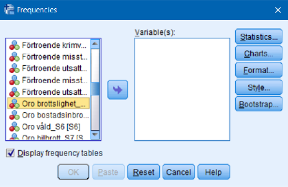
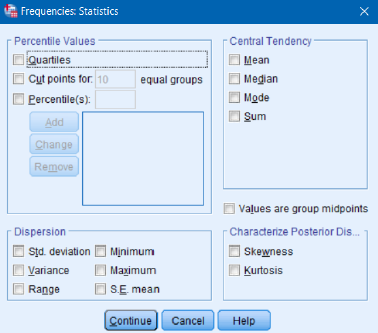
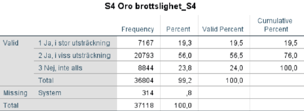

# (PART\*) Analysera data I {-}

# Beskrivande statistik

## Frekvenstabeller, central- och spridningsmått

Det är vanligt att man inleder en studie med att studera hur observationsenheterna fördelar sig med
avseende på en enskild variabel. Viktiga verktyg i detta ändamål är frekvenstabeller, centralmått och
spridningsmått. Anta att du studerar den Nationella trygghetsundersökningen (NTU 2013-15 M2.sav)
och vill ha information om oro över brottsligheten i samhället:

Analyze > Descriptive statistics > Frequencies

Börja med att söka upp den variabel du är intresserad av i rullistan till vänster (kom ihåg att du kan
välja att visa variabelnamn eller variabeletiketter genom att högerklicka på listan). Därefter markerar
du variabeln och flyttar över den till den högra rutan genom att använda pilen mellan rutorna

alternativt dubbelklicka på variabeln. Om du nu väljer alternativet ”OK” kommer SPSS att producera en
frekvenstabell på variabeln. Detta är standardvalet (som du kan se är valet ”Display frequency tables”
markerat), men ofta vill man sammanfatta sin variabel lite mer utförligt. Längst till höger finns
möjligheter att ytterligare specificera vad du vill få fram för statistik. Till exempel kan du genom att
klicka på ”Statistics” välja central- och spridningsmått

Skalnivån (mätnivån) för frågan om oro är på ordinal nivå varför vi i detta fall nöjer oss med en
frekvenstabell:

Av frekvenstabellen kan vi utläsa mer specifikt hur många individer och hur stor andel som uppger sig
vara oroliga för brottsligheten i samhället. Vi kan till exempel se att endast 24 procent svarar att de
inte alls är oroliga.

## Kort om grafiska tekniker

I syfte att beskriva våra resultat i grafisk form kan man även välja ”Graphs” i huvudmenyn. Genom
alternativet ”Chart Builder” kan du välja på en mängd olika diagramtyper som på bästa sätt beskriver
din/a variabel/ler. Alltså:

Graphs > Chart Builder

Vanliga diagramtyper för att beskriva enskilda variabler är stapeldiagram (”Bar chart”), cirkeldiagram
(”Pie chart”) och histogram. Med detta verktyg kan du på grafisk väg även studera eventuella samband
mellan två variabler. Vi återkommer senare till att åskådliggöra samvariationen mellan två kontinuerliga
variabler genom att ta fram ett så kallat spridningsdiagram (”Scatter plot”).