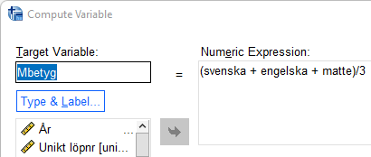

# (PART\*) Analysera data III: Hypotesprövning  {-}

Samhällsvetare arbetar nästan alltid med urval dragna ur en population men vill generalisera till hela
populationen. Den gren inom statistik som hjälper oss att göra detta kallas statistisk inferens.
Arbetsgången att pröva de samband vi är intresserade av är att ställa upp nollhypotes och mothypotes,
där nollhypotesen uttrycker att det inte finns en skillnad medan mothypotesen uttrycker att det finns
en skillnad. Det vi prövar är något förenklat om skillnaderna och de samband vi undersöker är tillräckligt
stora för att kunna antas gälla i populationen. Om så är fallet förkastar vi nollhypotesen.

Under detta avsnitt följer två vanliga metoder för hypotesprövning för att avgöra om ett samband är
signifikant: chi2 och t-test. Chi2 används när oberoende och beroende variabel befinner sig på nominal
eller ordinal skalnivå, medan t-test används när den oberoende variabeln befinner sig på nominal eller
ordinal skalnivå och har två kategorier medan den beroende variabeln är kontinuerlig och befinner sig
på intervall- eller kvotskala.

Oavsett vilket av dessa signifikanstest som är lämpligt kommer ni på liknande sätt att tolka det p-värde
som SPSS beräknar för att avgöra om ett samband är signifikant eller inte. Är en uppmätt skillnad
”verklig” eller kan den bero på slumpen? Ett p-värde under 0.05 är signifikant på fem procents nivå, ett
värde under 0.01 på en procents nivå och ett värde under 0.001 på en promilles nivå. Vanligt är att
ställa upp fem procent signifikansnivå som gräns för vad som ska anses vara ett signifikant resultat. Det
innebär att endast i fem fall av hundra skulle urvalet visa på en skillnad som egentligen inte existerar i
populationen. Ett annat sätt att uttrycka detta på är att risken att vi förkastar en sann nollhypotes är
fem procent (kallas även typ 1-fel).

# Chi2-test för oberoende

I exemplet ovan kunde vi se att oro för brottsligheten i samhället skiljer sig för män och kvinnor. Utifrån
vår korstabell kan vi dock endast uttala oss om förhållandet i urvalet. Vad vi nu vill ta reda på är om detta
samband mellan kön och oro för brottsligheten är tillräckligt tydligt för att kunna antas gälla i
populationen, dvs. i befolkningen. Eftersom vi har två kategoriska variabler är chi2 ett lämpligt
signifikansmått. Proceduren i beräkningen av chi2 är att jämföra observerade frekvenser med de
frekvenser som skulle förväntas om det inte fanns någon skillnad. Genom denna jämförelse får vi fram
ett chi2-värde som vi i nästa steg kan jämföra med en så kallad chi2-fördelning för att ta reda på
huruvida detta värde överstiger ett kritiskt värde som motsvarar en given signifikansnivå. Genom denna
procedur skulle vi utifrån vår korstabell kunna räkna ut huruvida sambandet är signifikant eller inte,
men som tur är har vi SPSS till vår hjälp. Arbetsgången är följande:

Analyze > Descriptive statistics > Crosstabs

Välj precis som tidigare att placera ”kön” i kolumnled och ”S4” i radled. Välj även, precis som tidigare,
att sammanställa korstabellen med kolumnprocent under alternativet ”Cells”. Klicka därefter på
”Statistics” och markera alternativet ”Chi-square”. Klicka på ”Continue” och därefter ”OK”. Utöver korstabellen får du nu även en tabell som ger
information om ditt begärda Chi2-test.

Titta på raden ”Pearson Chi-Square” och kolumnen ”Asymp. Sig. (2-sided)”. Här kan du se att ditt pvärde
är mindre än 0.01. Skillnaderna är alltså så pass stora att dessa på en procents signifikansnivå kan
antas gälla i populationen. Observera att du även har ett stort antal observationer, vilket även det har
betydelse för dina möjligheter att finna skillnader som går att generalisera (gör att du får ett högre Chi2
värde). Sambandet är signifikant på en procents signifikansnivå och vi kan alltså generalisera våra
resultat till att gälla för hela populationen.

Observera dock att SPSS anger att 0 celler har förväntade värden som understiger fem. Som regel gäller
att Chi2-testet är ogiltigt om 20% av cellerna har ett förväntat värde mindre än 5 eller en cell har ett
förväntat värde mindre än 1 då korstabellen är större än 2x2. Om korstabellen är 2x2 får ingen av
cellerna ha ett förväntat värde som är mindre än 5. I detta fall är dock signifikanstestet giltigt. Om chi2-
testet skulle visa sig vara ogiltigt kan lösningen vara att klassindela sina variabler med hjälp av
kommandot Recode (se ovan under avsnittet Databearbetning).

# Oberoende t-test

När du vill pröva om en skillnad mellan två grupper är signifikant och utfallsvariabeln är kontinuerlig är
ett oberoende t-test tillämpligt. Här är proceduren att jämföra medelvärden mellan två grupper och
utifrån den uppmätta skillnaden ta reda på om den är tillräckligt stor för att antas gälla i populationen.
Anta att du är intresserad av om det finns någon skillnad i pojkars och flickors medelbetyg. Du vill
jämföra ett sammanfattande mått på deras betyg i kärnämnena svenska, engelska och matematik.
Betygsvariablerna är på ordinalskala och antar värden 0-3, se frekvenstabell nedan för betyg i
svenska:

Du skapar ett betygsindex (”Mbetyg”) som varierar mellan 0-3 genom att summera de tre betygen
och dividera med tre med hjälp av funktionen compute (se ovan under databearbetning).För att göra ett oberoende t-test, där du prövar om det finns en signifikant skillnad mellan pojkars och
flickors genomsnittliga betyg, är tillvägagångssättet följande: 

Analyze > Compare Means > Independent Samples T-test

Oberoende variabel är i detta fall ”kon” medan den beroende variabeln är ”Mbetyg”. Flytta den
beroende variabeln till rutan ”Test Variable(s)” och den oberoende variabeln till rutan ”Grouping
Variable”. Därefter måste du definiera vilka grupper inom denna variabel som du är intresserad av.
Genom att i variabelfönstret undersöka variabeln ”kon” ser du att variabelvärde 0 står för ”flickor”
och variabelvärde 1 står för ”pojkar”. Klicka på ”Define Groups” och ange dessa variabelvärden i
rutorna ”Group 1:” respektive ”Group 2:”. Klicka därefter ”Continue”.

Klicka ”OK” och gå till Output-fönstret. Du får nu fram resultaten i två tabeller. I den första tabellen
redovisas deskriptiva mått som antalet i respektive grupp samt respektive grupps medelvärde och
standardavvikelse på den beroende variabeln.

Vi ser att medelvärdet på betygsindex är 1,59 för flickor och 1,39 för pojkar. Flickor har alltså högre
betyg. Men är denna skillnad signifikant, d.v.s. kan anta att den även existerar mellan pojkar och
flickor i populationen? För att avgöra det tittar vi på nästa tabell:

I tabellen ovan redovisas ett antal relevanta mått för det oberoende t-testet. ”Mean Differance” är
skillnaden mellan de båda medelvärdena. I detta fall är skillnaden i genomsnittligt betyg 0,196.
Frågan är emellertid om skillnaden är tillräckligt stor för att fastställa att medelvärden skiljer sig åt i
populationen? P-värdet vid ett tvåsidigt hypotestest går att finna under rubriken ”Sig. (2-tailed)”. Ett
värde under 0,05 är signifikant på fem procents nivån. Här har vi ett värde på 0,00 vilket understiger
denna gräns. Vi kan således förkasta nollhypotesen som uttryckte att det genomsnittliga betyget är
samma för pojkar och flickor. (se vidare Djurfeldt m.fl. 2010/2018, s 230ff).

När vi gått igenom t-test på lektionerna har ett antagande gjorts om att de båda grupperna har samma
varians. Det finns emellertid två olika test - med eller utan antagande om lika varians (equal variance
assumed / equal variance not assumed). Skall man gå korrekt tillväga kontrollerar man att antagandet
håller. Det görs med Levene´s test for Equalite of Variances. F är kvoten av de båda gruppernas varians
och om denna kvot inte är lika med 1 kan det signalera att antagandet om lika varians inte håller. Om
sannolikheten för detta F-värde är mindre än 0,05 drar vi slutsatsen att skillnaden mellan urvalens
varians reflekterar en skillnad i populationernas varians. Om så är fallet, vilket det emellertid inte är här
(P = 0,10) går vi till ”Equal variance not assumed”. ” Equal variance assumed” är mer restriktivt vilket
betyder att det är svårare att få ett signifikant resultat. Därför kan ni lika gärna använda detta test.

# Enkel regression

# Multipel regression
