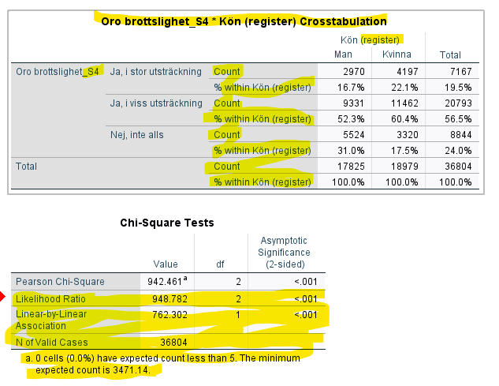
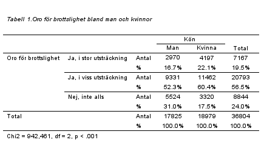
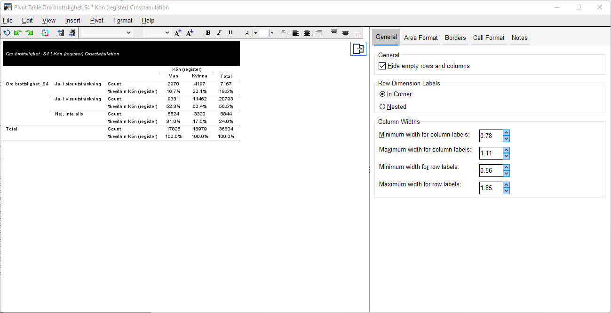
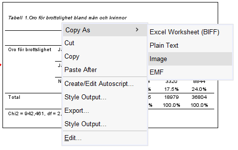
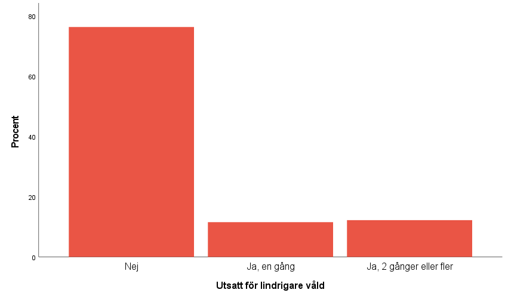

# (PART\*) Övrigt  {-}

# Bearbeta tabeller och figurer

För att öka förståelsen för den berättelse som en rapport eller uppsats vill förmedla gäller det att bland annat ha lättlästa (och snygga!) tabeller och figurer. Ibland kallas denna process för att göra tabeller och figurer <i>publikationsredo</i>. I detta kapitel kommer vi gå igenom hur man effektiviserar och gör SPSS-output estetiskt tillfredsställande. Att bearbeta figurer och tabeller medför oftast också att de komprimeras storleksmässigt vilket innebär att de inte tar lika stor plats i en text. Inte sällan tampas vi med ord- eller sidbegränsningar när vi skriver och tabeller som tar upp onöidigt stor plats kan leda till att vi inte kanske kan få med all den text som vi önskar. 

## Tabeller

I detta exempel ska vi effektivisera och snygga till en korstabell med tillhörand chi2-test. Notera att ni även kan följa denna guide även om ni gör en enkel frekvenstabeller (eller annan typ av tabell). I SPSS ser outputen ut som följande:

Notera för det första hur mycket av outputen som antingen behöver bearbetas eller som kan strykas. Det är exempelvis ord som är på englska, variabelnamn som innehåller tecken/ord som inte bör vara där, stora delar av chi2-testet som är överflöding information. Vi vill effektivisera outputen med målet att göra en tabell som ser ut som följande:

Inte nog med att vi har skapat en snygg tabell, vi har även gjort den avsevärt mycket mer komprimerad vilket innebär att vi får plas med mer text. Chi2-tabellen helt försvunnit och den information som fanns i den och som är relevant finns nu prydligt under korstabellen.

För att återskapa den reviderade tabellen gör vi som följande:

1. Innan vi ens skapar korstabellen klickar vi in  oss på: Edit > Options och därefter fliken Pivot Tables.

2. Markera sedan APA_SansSerif_10pt. Klicka därefter på OK. Vi har nu angett att samtliga tabeller som vi skapar ska följa den mall vi precis angivit (notera att det inte finns något krav att just denna mall skall följas utan ni kan klicka er runt och använda er av andra mallar om ni önskar).

3. Skapa därefter den korstabell ni önskar.

4. När ni har fått fram tabellen i output-fönstret så dubbelklickar ni var som helst på korstabellen.

5. Ni ska nu ha fått fram Pivot Table-rutan. Det är här ni redigerar innehållet i er tabell.

6. Vi börjar med att skapa en kommentar under tabellen med information från chi2-test. Klicka på Insert > Caption. Skriv därefer in chi2-värdet (<i>Pearson Chi-Square</i>), frihetsgraderna (<i>df</i>) och därefter p-värdet (<i>Asymptotic Significance (2-sided)</i>) precis som vi gjorde i den färdiga tabellen här ovan.

7. Nu ska vi redigera variabelnamnen, titeln och annat så att tabellen ser prydlig ut. För att redigera rubrik och annan text dubbelklickar ni helt enkelt på delen av tabellen som ni vill textredigera. Ett textfält ska då dyka upp där ni skriver in den nya text ni önskar. Notera att SPSS kan vara lite envis ibland och vägra ge er textfältet. Dubbelklicka på nytt eller testa att klicka någon annan stans och sedan dubbelklicka på nytt på texten så ska SPSS till slut ge med sig.

8. När ni känner er klara så klicka File > Close. Nu ska er tabell ha uppdaterats utifrån era önskemål.

9. För att förflytta tabellen från output-fönstret till Word så högerklickar ni på tabellen, väljer Copy As > Image. Tabellen är nu kopierad som bild vilket innebär att ni nu kan klistra in den i Word.

Nu är nu klara och har en avsevärt prydligare och komprimerad tabell!

### Videoinstruktioner

<iframe id="kaltura_player" src="https://api.kaltura.nordu.net/p/365/sp/36500/embedIframeJs/uiconf_id/23452190/partner_id/365?iframeembed=true&playerId=kaltura_player&entry_id=0_mwhfu1n7&flashvars[streamerType]=auto&amp;flashvars[localizationCode]=sv_SE&amp;flashvars[leadWithHTML5]=true&amp;flashvars[sideBarContainer.plugin]=true&amp;flashvars[sideBarContainer.position]=left&amp;flashvars[sideBarContainer.clickToClose]=true&amp;flashvars[chapters.plugin]=true&amp;flashvars[chapters.layout]=vertical&amp;flashvars[chapters.thumbnailRotator]=false&amp;flashvars[streamSelector.plugin]=true&amp;flashvars[EmbedPlayer.SpinnerTarget]=videoHolder&amp;flashvars[dualScreen.plugin]=true&amp;flashvars[hotspots.plugin]=1&amp;flashvars[Kaltura.addCrossoriginToIframe]=true&amp;&wid=0_9u5cccu0" width="608" height="402" allowfullscreen webkitallowfullscreen mozAllowFullScreen allow="autoplay *; fullscreen *; encrypted-media *" sandbox="allow-forms allow-same-origin allow-scripts allow-top-navigation allow-pointer-lock allow-popups allow-modals allow-orientation-lock allow-popups-to-escape-sandbox allow-presentation allow-top-navigation-by-user-activation" frameborder="0" title="Kaltura Player"></iframe>

## Figurer

Figurera i SPSS är till stora delar redan publikationsredo och det som ibland kan vara lämpligt att förändra är kanske mindre kosmetiska saker så som att översätta engelska ord eller se till att vissa ord börjar på stor bokstav. Målen med denna guide är att gå från följande figur:

Till följande:

Förändringarna vi har gjort är inte lika stora som förändringarna för frekvenstabellen här ovan. Inte heller är de förändringar som gjorts nödvändiga utan vissa av åtgärderna är mest gjorda för att visa er var i SPSS som man kan göra förändringar av figurer. Det som är förändrat är att de horisontella linjerna (<i>grid lines</i>) är borttagna, färgen på staplarna är förändrade, stor bokstav på variabelvärdena, tagit bort rubriken och översatt engelskt ord. Det finns även andra saker man kan tänkas göra för att förbättra figuren men dessa få åtgärder är en bra start och visar vilka fönster som finns att tillgå för att förändra en figur.

Börja med att skapa en figur via Graphs > Chart builder eller Charts-knappen när ni skapar en frekvenstabell. Därefter dubbelklickar ni var som helst på figuren alternativt högerklickar och trycker på Edit. Chart editor-fönstret ska nu öppnas upp. Det är härifrån ni gör samtliga era förändringar på figuren.

Först ut tar vi bort rubriken. Högerklicka på rubriken och tryck därefter på Delete. Nu är rubriken borta. Om ni iställt vill redigera rubriken så enkelklickar ni på rubriken. Vänta sedan någon sekund och enkelklicka igen på rubriken. Nu kan ni redigera den.

Näst på tur är att översätta rubiken för y-axeln, från engelska till svenska. Enkelklicka på texten, vänta en sekund och enkelklicka sedan igen. Nu kan ni redigera texten till svenska.

För att redigera variabelnvärdena på x-axeln så att de alla börjar med stor bokstav så gör ni på samma sätt som här ovan. Enkelklicka på en av värdena, vänta en sekund och sedan enkelklicka på nytt. Nu kan ni redigrera texten. Gör så på samtliga variabelvärden.

För att ta bort de horisontella linjerna (<i>grid lines</i>) trycker ni på Options > Hide Grid Lines.

Slutligen ska vi ändra färgen på staplarna. Dubbelklicka på någon av staplarna. Tryck sedan på fliken Fill & Border. Välj därefter vilken färg ni vill ha på staplarna (under Fill). Tryck därefter på Apply.

När ni känner er klara med era förändringar så klickar ni på File > Close. Nu ska er befintliga figur har uppdaterats efter era önskemål.

### Videoinstruktioner

<iframe id="kaltura_player" src="https://api.kaltura.nordu.net/p/365/sp/36500/embedIframeJs/uiconf_id/23452190/partner_id/365?iframeembed=true&playerId=kaltura_player&entry_id=0_wc0xwunq&flashvars[streamerType]=auto&amp;flashvars[localizationCode]=sv_SE&amp;flashvars[leadWithHTML5]=true&amp;flashvars[sideBarContainer.plugin]=true&amp;flashvars[sideBarContainer.position]=left&amp;flashvars[sideBarContainer.clickToClose]=true&amp;flashvars[chapters.plugin]=true&amp;flashvars[chapters.layout]=vertical&amp;flashvars[chapters.thumbnailRotator]=false&amp;flashvars[streamSelector.plugin]=true&amp;flashvars[EmbedPlayer.SpinnerTarget]=videoHolder&amp;flashvars[dualScreen.plugin]=true&amp;flashvars[hotspots.plugin]=1&amp;flashvars[Kaltura.addCrossoriginToIframe]=true&amp;&wid=0_5idxsyr8" width="608" height="402" allowfullscreen webkitallowfullscreen mozAllowFullScreen allow="autoplay *; fullscreen *; encrypted-media *" sandbox="allow-forms allow-same-origin allow-scripts allow-top-navigation allow-pointer-lock allow-popups allow-modals allow-orientation-lock allow-popups-to-escape-sandbox allow-presentation allow-top-navigation-by-user-activation" frameborder="0" title="Kaltura Player"></iframe>

