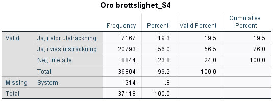

# (PART\*) Analysera data I: Univariat analys & beskrivande statistik {-}

# Frekvenstabeller, central- och spridningsmått

Innan ens hypoteser sätts på prov utförs en så kallad deskriptiv analys där ens datamaterial och i synnerhet de aktuella variabler sammanfattas på olika kvantitativa sätt. Oftast görs det med hjälp av att frekvenstabeller, central- och spridningsmått.

## Frekvenstabell

Det är vanligt att man inleder en studie med att studera hur observationsenheterna fördelar sig med
avseende på en enskild variabel. Viktiga verktyg i detta ändamål är frekvenstabeller, centralmått och
spridningsmått. Anta att du studerar den Nationella trygghetsundersökningen (NTU 2013-15 M2.sav)
och vill ha information om oro över brottsligheten i samhället:

Analyze > Descriptive statistics > Frequencies

Börja med att söka upp den variabel du är intresserad av i rullistan till vänster (kom ihåg att du kan
välja att visa variabelnamn eller variabeletiketter genom att högerklicka på listan). Därefter markerar
du variabeln och flyttar över den till den högra rutan genom att använda pilen mellan rutorna alternativt dubbelklicka på variabeln. Klicka därefter på **OK**.

Av frekvenstabellen kan vi utläsa mer specifikt hur många individer och hur stor andel som uppger sig
vara oroliga för brottsligheten i samhället. Vi kan till exempel se att endast 24 procent svarar att de
inte alls är oroliga.

### Videoinstruktioner

<iframe id="kaltura_player" src="https://api.kaltura.nordu.net/p/365/sp/36500/embedIframeJs/uiconf_id/23452190/partner_id/365?iframeembed=true&playerId=kaltura_player&entry_id=0_oa93699k&flashvars[streamerType]=auto&amp;flashvars[localizationCode]=sv_SE&amp;flashvars[leadWithHTML5]=true&amp;flashvars[sideBarContainer.plugin]=true&amp;flashvars[sideBarContainer.position]=left&amp;flashvars[sideBarContainer.clickToClose]=true&amp;flashvars[chapters.plugin]=true&amp;flashvars[chapters.layout]=vertical&amp;flashvars[chapters.thumbnailRotator]=false&amp;flashvars[streamSelector.plugin]=true&amp;flashvars[EmbedPlayer.SpinnerTarget]=videoHolder&amp;flashvars[dualScreen.plugin]=true&amp;flashvars[hotspots.plugin]=1&amp;flashvars[Kaltura.addCrossoriginToIframe]=true&amp;&wid=0_0ogmypot" width="608" height="402" allowfullscreen webkitallowfullscreen mozAllowFullScreen allow="autoplay *; fullscreen *; encrypted-media *" sandbox="allow-forms allow-same-origin allow-scripts allow-top-navigation allow-pointer-lock allow-popups allow-modals allow-orientation-lock allow-popups-to-escape-sandbox allow-presentation allow-top-navigation-by-user-activation" frameborder="0" title="Kaltura Player"></iframe>

##  Central- och spridningsmått

För att få en förståelse för de enstaka variablernas tyngdpunkt samt spridning tas oftast central- och spridningsmått fram. På så sätt får man fram genomsnittligt värde samt spridningen runt genomsnittet.

För att få fram central- och spridningsmått gör vi precis som här ovan:

Analyze > Descriptive statistics > Frequencies

Vi matar in den variabel som vi vill ta fram mått för och trycker därefter på **Statistics**. Under **Central Tendency** kan vi välja de olika centralmåtten som finns att tillgå och under **Dispersion** kan vi välja de olika spridningsmåtten. När vi har markerat de mått vi önskar trycker vi  **Continue** och därefter **OK**,

I detta exempel har vi tagit ut genomsnittet och medianen samt standardavvikelse för variabeln TotBrott från Skolundersöknigen 2005. Variabeln i fråga redogör för antal självuppskattade brott en ungdom har begått senaste året.

Här kan vi se att genomsnittlig brottslighet är 9.4 och att medianen är 3. Vidare ser vi att standardavvikelsen är 18.7.

### Videoinstruktioner

<iframe id="kaltura_player" src="https://api.kaltura.nordu.net/p/365/sp/36500/embedIframeJs/uiconf_id/23452190/partner_id/365?iframeembed=true&playerId=kaltura_player&entry_id=0_zub9l4gg&flashvars[streamerType]=auto&amp;flashvars[localizationCode]=sv_SE&amp;flashvars[leadWithHTML5]=true&amp;flashvars[sideBarContainer.plugin]=true&amp;flashvars[sideBarContainer.position]=left&amp;flashvars[sideBarContainer.clickToClose]=true&amp;flashvars[chapters.plugin]=true&amp;flashvars[chapters.layout]=vertical&amp;flashvars[chapters.thumbnailRotator]=false&amp;flashvars[streamSelector.plugin]=true&amp;flashvars[EmbedPlayer.SpinnerTarget]=videoHolder&amp;flashvars[dualScreen.plugin]=true&amp;flashvars[hotspots.plugin]=1&amp;flashvars[Kaltura.addCrossoriginToIframe]=true&amp;&wid=0_3mkyp7o4" width="608" height="402" allowfullscreen webkitallowfullscreen mozAllowFullScreen allow="autoplay *; fullscreen *; encrypted-media *" sandbox="allow-forms allow-same-origin allow-scripts allow-top-navigation allow-pointer-lock allow-popups allow-modals allow-orientation-lock allow-popups-to-escape-sandbox allow-presentation allow-top-navigation-by-user-activation" frameborder="0" title="Kaltura Player"></iframe>

## Kort om grafiska tekniker

I syfte att beskriva våra resultat i grafisk form kan man även välja ”Graphs” i huvudmenyn. Genom
alternativet ”Chart Builder” kan du välja på en mängd olika diagramtyper som på bästa sätt beskriver
din/a variabel/ler. Alltså:

Graphs > Chart Builder

Vanliga diagramtyper för att beskriva enskilda variabler är stapeldiagram (”Bar chart”), cirkeldiagram
(”Pie chart”) och histogram. Med detta verktyg kan du på grafisk väg även studera eventuella samband
mellan två variabler. Vi återkommer senare till att åskådliggöra samvariationen mellan två kontinuerliga
variabler genom att ta fram ett så kallat spridningsdiagram (”Scatter plot”).

Det går även att i samband med skapandet av en frekvenstabeller ange att man vill ha ett diagram. De diagram som då finns att tillgå är stapeldiagram, cirkeldiagram och histogram. Klicka er fram till rutan för frekvenstabeller:

Analyze > Descriptive statistics > Frequencies

Mata sedan in den variabel som ni vill skapa ett diagram över. Klicka därfter på knappen Charts. Välj sedan vilket diagram ni önskar att få fram. Klicka därefter på Continue och sedan OK. I output:en ska ni nu ha fått fram en frekvenstabell samt den figur ni har valt.

### Videoinstruktioner

<iframe id="kaltura_player" src="https://api.kaltura.nordu.net/p/365/sp/36500/embedIframeJs/uiconf_id/23452190/partner_id/365?iframeembed=true&playerId=kaltura_player&entry_id=0_oa93699k&flashvars[streamerType]=auto&amp;flashvars[localizationCode]=sv_SE&amp;flashvars[leadWithHTML5]=true&amp;flashvars[sideBarContainer.plugin]=true&amp;flashvars[sideBarContainer.position]=left&amp;flashvars[sideBarContainer.clickToClose]=true&amp;flashvars[chapters.plugin]=true&amp;flashvars[chapters.layout]=vertical&amp;flashvars[chapters.thumbnailRotator]=false&amp;flashvars[streamSelector.plugin]=true&amp;flashvars[EmbedPlayer.SpinnerTarget]=videoHolder&amp;flashvars[dualScreen.plugin]=true&amp;flashvars[hotspots.plugin]=1&amp;flashvars[Kaltura.addCrossoriginToIframe]=true&amp;&wid=0_0ogmypot" width="608" height="402" allowfullscreen webkitallowfullscreen mozAllowFullScreen allow="autoplay *; fullscreen *; encrypted-media *" sandbox="allow-forms allow-same-origin allow-scripts allow-top-navigation allow-pointer-lock allow-popups allow-modals allow-orientation-lock allow-popups-to-escape-sandbox allow-presentation allow-top-navigation-by-user-activation" frameborder="0" title="Kaltura Player"></iframe>

