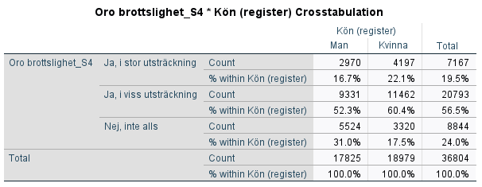
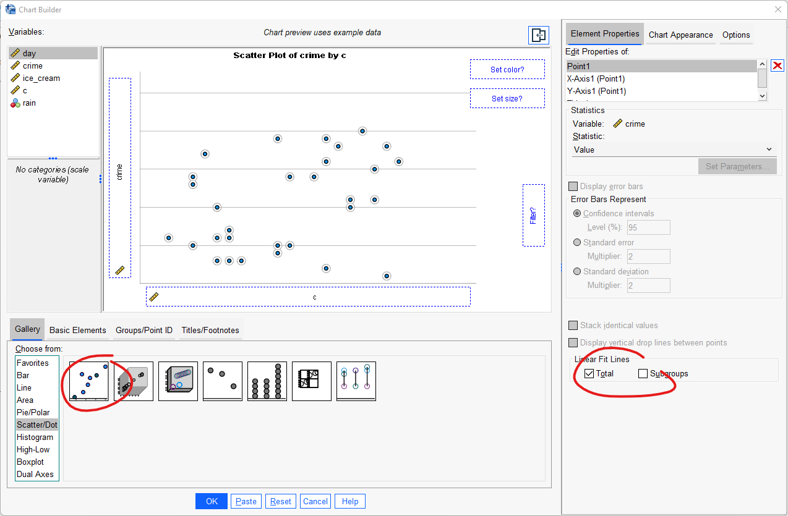
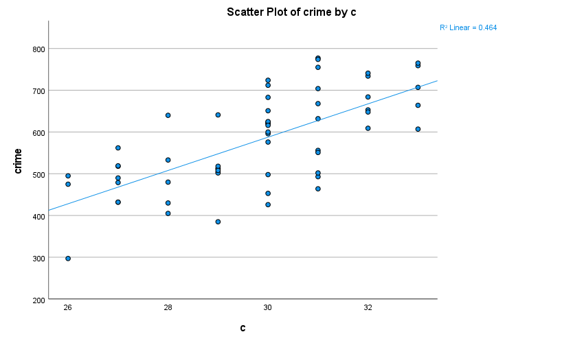

# (PART\*) Analysera data II: Bivariat analys {-}

# Studera samvariationen mellan två variabler

Ofta vill vi se hur två variabler korrelerar eller samvarierar. Hur bivariata samband undersöks bestäms helt uifrån vilken datanivå era variabler har. Notera  att när vi utför hypotesprövningar kan även dessa bestå av bivariata samband. Här nedan följer dock några sätt för att studera specifikt bivariata samband.  

## Korstabell - Samband mellan två kategoriska variabler 

Under förutsättning att variablernas skalnivåer är nominal- eller ordinalskala (ej intervall- eller
kvotskala) analyseras sambandet vanligtvis genom att studera de båda variablerna i en korstabell (”Crosstab”). Gör följande:

Analyze > Descriptive statistics > Crosstabs

I detta fönster har du likt tidigare en rullista till vänster som innehåller samtliga variabler i
datamaterialet. Innan du fortsätter är det viktigt att du, med hänvisning till din frågeställning, har gjort klart vilken variabel som är tänkt att påverka den andra. Beroende variabel placeras i radled (”Row(s)”) och oberoende variabel placeras i kolumnled (”Column(s)”). Vi kan t.ex. vara intresserade av huruvida oro för brottsligheten i samhället skiljer sig åt efter kön. Vi gör då en korstabell med variablerna S4 (Oro brottslighet) Kön. Identifiera variablerna i rullistan till vänster och för sedan över dessa till ”Row(s)” respektive ”Column(s)” genom att använda pilarna. I detta fall gjordes alltså antagandet att Kön är
oberoende. Som framgår finns ytterligare funktioner/alternativ. För kursen relevanta rutor är här
”Statistics”, ”Cells” och ”Format”. Under ”Statistics” kan man välja mellan ett flertal olika
sambandsmått och signifikanstest. Vi återkommer till sambandsmått och signifikanstest, nu ligger
fokus på att konstruera en korstabell som kan möjliggöra tolkningen av om och i så fall hur våra
variabler är relaterade till varandra. För att underlätta denna tolkning väljer du först alternativet
”Cells”.

Att sammanställa tabellen endast med antal observationer i varje cell gör en jämförelse svår. Under
rubriken ”Percentages” är det är möjligt att markera om korstabellen ska sammanställas med rad-
(”Row), kolumn- (”Column”), och/eller totalprocent (”Total”). Radprocent innebär att summera
varje rad till 100 procent, medan totalprocent innebär att redovisa hur stor andel varje cell utgör av
samtliga observationer. Här har vi valt att markera kolumnprocent, med vilket avses att kolumnerna
summeras upp till 100 procent.

När den oberoende variabeln är placerad i kolumnled och den beroende variabeln i radled möjliggör
valet av kolumnprocent tolkningen av huruvida det verkar finnas ett samband mellan variablerna –
om oro för brottsligheten i samhället skiljer sig åt mellan män och kvinnor. Eftersom vi konsekvent
väljer att placera våra variabler på detta sätt kommer vi alltså i syfte att utreda ett eventuellt samband
alltid vilja redovisa korstabellen med kolumnprocent. Klicka på ”Continue” när du gjort ditt val.
Slutligen ska vi ta en titt på alternativet ”Format”. Här kan du välja om radledet ska redovisas i stigande
(”Ascending”) eller fallande (”Descending”) ordning. I syfte att tolka riktningen på sambandet kan valet
av stigande eller fallande ordning underlätta, men detta är en smaksak och du kommer oavsett val
kunna göra samma tolkning av korstabellen i syfte att utreda ett eventuellt samband. I detta fall har
standaralternativet stigande ordning valts, vilket innebär att korstabellen i radled kommer att
sammanställas med det lägsta värdet överst. Klicka på ”Continue” när du gjort ditt val.

Klicka därefter ”OK” så producerar SPSS en korstabell över relationen mellan kön och oro för brottsligheten.
Resultatet visas i output fönstret. Så som vi har valt att sammanställa vår korstabell (oberoende variabel
i kolumnled och beroende variabel i radled och sammanställd med kolumnprocent) är det nu möjligt att
se om om det verkar finnas ett samband mellan kön och oro för brottsligheten i samhället. Nästa steg är
att tolka korstabellen. Tekniken är att jämföra kategorierna i den oberoende variabeln radvis.

I korstabellen kan vi se att 31 procent av männen jämfört med 17,5 procent av kvinnorna svarat att de
inte alls är oroliga. Det verkar alltså som att det finns ett samband i den meningen att kvinnor är mer
oroliga för brottsligheten än män.

Eftersom vi har en variabel på ordinal nivå (oro) och en på nominal nivå (kön), kan vi inte uttala oss om
riktningen på sambandet, dvs. om det rör sig om ett positivt eller negativt samband (hur vi kodat
variabeln kön, dvs. vilket kön som kodats som 1 eller 2, är ju godtyckligt).

### Videoinstruktioner

<iframe id="kaltura_player" src="https://api.kaltura.nordu.net/p/365/sp/36500/embedIframeJs/uiconf_id/23452190/partner_id/365?iframeembed=true&playerId=kaltura_player&entry_id=0_9obbpy7v&flashvars[streamerType]=auto&amp;flashvars[localizationCode]=sv_SE&amp;flashvars[leadWithHTML5]=true&amp;flashvars[sideBarContainer.plugin]=true&amp;flashvars[sideBarContainer.position]=left&amp;flashvars[sideBarContainer.clickToClose]=true&amp;flashvars[chapters.plugin]=true&amp;flashvars[chapters.layout]=vertical&amp;flashvars[chapters.thumbnailRotator]=false&amp;flashvars[streamSelector.plugin]=true&amp;flashvars[EmbedPlayer.SpinnerTarget]=videoHolder&amp;flashvars[dualScreen.plugin]=true&amp;flashvars[hotspots.plugin]=1&amp;flashvars[Kaltura.addCrossoriginToIframe]=true&amp;&wid=0_fd4t3pj0" width="608" height="402" allowfullscreen webkitallowfullscreen mozAllowFullScreen allow="autoplay *; fullscreen *; encrypted-media *" sandbox="allow-forms allow-same-origin allow-scripts allow-top-navigation allow-pointer-lock allow-popups allow-modals allow-orientation-lock allow-popups-to-escape-sandbox allow-presentation allow-top-navigation-by-user-activation" frameborder="0" title="Kaltura Player"></iframe>

## Samband mellan två numeriska variabler

När vi har att göra med variabler som befinner sig på intervall- eller kvotskala är varken korstabell eller
ovan nämnda sambandsmått lämpliga verktyg för att utreda ett eventuellt samband. Föreställ dig till
exempel att undersöka sambandet mellan ålder och brott i en korstabell, där respondenten i
enkätundersökningen har fått ange sin ålder och även självskatta antalet begångna brott under det
senaste året – det skulle resultera i en enorm korstabell eftersom varje specifik ålder- och
brottkombination kräver sin egen cell.

I detta fall är istället ett spridningsdiagram (”Scatter plot”) lämpligt att använda för att studera huruvida
ett samband verkar föreligga. Gör följande:

Graphs > Chart builder

Under ”Gallery”, klicka på ”Choose from”, välj ”Scatter / Dot” och dra ”Simple Scatter” upp till rutan
”Chart Preview”. Dra din oberoende variabel till rutan för x-axeln och din beroende variabel till rutan för
y-axeln. Bocka även för Total under Linear Fit Lines för att få ut en linje anpassad efter observationerna. Klicka därefter ”OK”.

Vi kan även använda sambandsmått för att beräkna styrka och riktning på sambandet. När vi har att
göra med två kontinuerliga variabler är sambandsmåttet Pearson’s r (korrelationskoefficienten r)
lämpligt att använda. Gör följande:

Analyze > Correlate > Bivariate

För över de variabler du vill korrelera till rutan ”Variables” och markera Pearson’s r. Klicka därefter
”OK”. Precis som tidigare nämnda sambandsmått varierar Pearson’s r på en skala mellan -1 och +1, där
0 indikerar att det inte finns ett samband medan -1 anger ett perfekt negativt samband och +1 anger ett
perfekt positivt samband.

### Videoinstruktioner

<iframe id="kaltura_player" src="https://api.kaltura.nordu.net/p/365/sp/36500/embedIframeJs/uiconf_id/23452190/partner_id/365?iframeembed=true&playerId=kaltura_player&entry_id=0_wzs7l4wl&flashvars[streamerType]=auto&amp;flashvars[localizationCode]=sv_SE&amp;flashvars[leadWithHTML5]=true&amp;flashvars[sideBarContainer.plugin]=true&amp;flashvars[sideBarContainer.position]=left&amp;flashvars[sideBarContainer.clickToClose]=true&amp;flashvars[chapters.plugin]=true&amp;flashvars[chapters.layout]=vertical&amp;flashvars[chapters.thumbnailRotator]=false&amp;flashvars[streamSelector.plugin]=true&amp;flashvars[EmbedPlayer.SpinnerTarget]=videoHolder&amp;flashvars[dualScreen.plugin]=true&amp;flashvars[hotspots.plugin]=1&amp;flashvars[Kaltura.addCrossoriginToIframe]=true&amp;&wid=0_7aik97ec" width="608" height="402" allowfullscreen webkitallowfullscreen mozAllowFullScreen allow="autoplay *; fullscreen *; encrypted-media *" sandbox="allow-forms allow-same-origin allow-scripts allow-top-navigation allow-pointer-lock allow-popups allow-modals allow-orientation-lock allow-popups-to-escape-sandbox allow-presentation allow-top-navigation-by-user-activation" frameborder="0" title="Kaltura Player"></iframe>

Ett alternativ till att studera relationen mellan exempelvis ålder och brott är att klassindela de
båda kontinuerliga variablerna till kategoriska variabler med hjälp av recode-kommandot (se under
Databearbetning). Man kan tänka sig att klassindela ålder till de tre klasserna ”ungdom”, ”ung vuxen”
samt ”vuxen”, samt brott till de tre klasserna ”inga brott”, ”1-2 brott”, ”3 eller fler brott”. På det sättet
skulle vi konstruera två variabler på ordinal skalnivå utav de två ursprungliga variablerna på kvotskala.
Därmed kan vi med de nya variablerna studera relationen mellan ålder och brott i en korstabell (i detta
fall med nio celler) och med de sambandsmått som är lämpliga för variabler på ordinal skalnivå. Tänk på
att variabler på högre skalnivå alltid kan transformeras till variabler på lägre skalnivå.

## Sambandsmått

Ibland vill man även uttala sig om sambandets styrka och i detta syfte är användningen av sambandsmått bra. I de fall som sambandets riktning är tolkningsbart ger sambandsmåttet även denna information. Statistiker har tagit fram olika sambandsmått som gäller för variabler som befinner sig på olika datanivåer. För att välja sambandsmått börja med följande:

Analyze > Descriptive statistics > Crosstabs

Placera din oberoende variabel i kolumnled och din beroende variabel i radled. Välj även, precis som
tidigare, att sammanställa korstabellen med kolumnprocent under alternativet ”Cells”. Klicka därefter
på ”Statistics”. Här får vi en viss vägledning av SPSS när det gäller vilka sambandsmått som är lämpliga att använda för våra variabler beroende på datanivå.
 

**Överkurs:**
Om ni  önskar att läsa er in på vilka sambandsmått som finns, när ni ska använda de och vilka sambandsmått som passar till vilken typ av variabler <a href="https://journals.sagepub.com/doi/10.1177/8756479308317006">rekommenderar vi följande artikel</a>.

