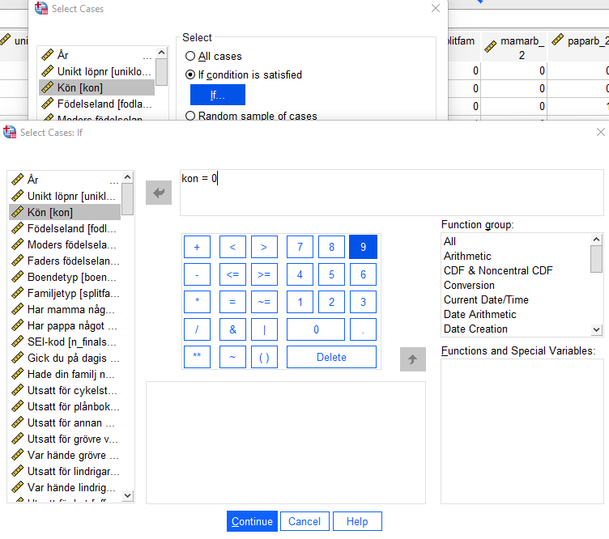

# (PART\*) Förbereda datamaterialet  {-}

# Databearbetning

En stor del av arbetet består av att bearbeta sitt datamaterial inför analys. Det finns ett antal funktioner
i SPSS med vilka man enkelt bearbetar materialet efter kodning. Kanske är du bara intresserad av att
studera vissa observationsenheter, t.ex. bara kvinnor? Eller så kanske du vill koda om variabler (slå ihop
svarskategorier eller klassindela) eller skapa nya variabler som bygger på information i två eller fler
befintliga variabler (t.ex. skapa ett index). Några funktioner för detta presenteras nedan.

## Select Cases: analysera enbart vissa observationssenheter

<p>Funktionen används när du endast vill undersöka vissa observationsenheter, exempelvis endast de
flickor som ingår i skolundersökningen. Hur variabeln kön har kodats framgår av variabelförteckningen
(du hittar denna som pdf fil i Athena), alternativt kan du markera variabeln i SPSS
genom att välja Utilities > Variables, leta reda på Kön i listan och titta i rutan ”Variable
information”.</p>

Följande kan då utläsas: Du finner att flickor har värdet 0 på variabeln ”kon”. För att enbart välja ut de observationsenheter som
är flickor (alltså har värdet ”0” på variabeln ”kon”) gör du följande:

Data > Select Cases > If condition is satisfied > If

Lyft in den aktuella variabeln i fönstret och ange villkor (variabelvärde för att tas med), därefter:

Continue > OK

<hr style="height:2px;border-width:0;color:gray;background-color:LavenderBlush">

<center></center>

<hr style="height:2px;border-width:0;color:gray;background-color:LavenderBlush">

Tänk på att du nu har angett att kommande analyser endast ska göras för de med värde ”0” på
variabeln ”kon”. Om du vill återgå till att analysera samtliga observationsenheter (både pojkar och
flickor), klickar du på alternativet ”All cases”. Alltså:

Data > Select Cases > All cases

Notera att det är variabeletiketten (”Kön”) och inte variabelnamnet (”kon”) som står i rullistan till
vänster i bilden ovan. Standardinställningen är att visa variabeletiketten om en sådan finns, men
ibland är det smidigare att istället visa variabelnamnet. För att göra detta högerklickar du på
variabellistan till vänster och markerar ”Display Variable Names”.

## Recode: att koda om befintliga variabler

Funktionen Recode kan användas till att koda om variabler (koda om befintlig variabel: ”Recode into
Same Variables”, eller till en ny variabel: ”Recode into Different Variables”). ”Recode” används ofta då
variabeln har många kategorier/variabelvärden som forskaren vill sammanfatta till färre
kategorier/variabelvärden. Det används om man vill kategorisera en kontinuerlig variabel (t.ex.
klassindela) eller om man vill slå ihop kategorier i en kategorisk vaiabel. Variabeln offgrov i
skolundersökning (Skol05.sav) har tre värden: 0, 1 respektive 2, se frekvenstabellen nedan:

<hr style="height:2px;border-width:0;color:gray;background-color:LavenderBlush">

<center></center>

<hr style="height:2px;border-width:0;color:gray;background-color:LavenderBlush">

Anta att du vill skapa en variabel som anbart skiljer på utsatt respektive ej utsatt för grövre våld. Du vill
alltså skapa en ny variabel där de som svarat ja hamnar i samma kategori oavsett om varit utsatta en
gång (variabelvärde 1) eller två gånger eller fler (variabelvärde 2). Du vill med andra ord att den nya
variabeln enbart ska ha två kategorier; Nej och Ja:

Transform > Recode into Different Variables

För över den variabel som du vill koda om till den stora rutan med rubriken ”Numeric Variable->Output
Variable” och ange vad den nya variabeln ska ha för variabelnamn (”Name”) och variabeletikett
(”Label”). Klicka därefter på ”Change”. I detta fall har den nya variabeln fått namnet offgrov2.

<hr style="height:2px;border-width:0;color:gray;background-color:LavenderBlush">

<center></center>

<hr style="height:2px;border-width:0;color:gray;background-color:LavenderBlush">

Gå sedan vidare och öppna ”Old and new values”. Ange variabelvärdet i den ursprungliga variabeln
(”Old Value”) och vilket värde detta ska bli i den nya variabeln (”New Value”). Koda om ett värde i
taget och klicka på ”Add” efter att du har angett det gamla och det nya variabelvärdet. I rutan ”Old > New:” 
får du en översikt på hur du har valt att göra omkodningen. Bilden nedan visar att både
värde 1 och värde 2 i den gamla variabeln ska ha värde 1 i den nya variabeln. När du har
kontrollerat att omkodningen ser riktig ut väljer du ”Continue” och sedan ”OK”. Kontrollera att du
har fått den nya variabeln tillagd längst ner i variabellistan (Variable view).

<hr style="height:2px;border-width:0;color:gray;background-color:LavenderBlush">

<center></center>

<hr style="height:2px;border-width:0;color:gray;background-color:LavenderBlush">

I exemplet ovan är det två variabelvärden i den gamla variabeln som slagits samman. Ibland har dock de
variabler du vill klassindela betydligt fler variabelvärden, och det är då osmidigt att ange varje enskilt
variabelvärde under ”Value:”. I dessa fall markerar du istället ”Range:” och anger i den övre rutan den
lägsta klassgränsen och i den nedre rutan den högsta klassgränsen. Tänk dig till exempel att du ska
klassindela variabeln ålder i Nationella trygghetsundersökningen. Istället för att under ”Value:” ange
vad varje enskild ålder ska tillhöra för klass kan du använda ”Range”. Ett tips: För att förtydliga vad dina
variabelvärden i den nya variabeln betyder letar du upp denna i variabelfönstret och anger detta under
”Values”.

## Compute: att skapa nya variabler utifrån befintliga variabler

<p>Med hjälp av funktionen Compute kan du skapa nya variabler. Antag att du vill slå samman – summera -
två variabler till en variabel. Att summera variabler kan användas för att skapa summaindex. Index
innebär alltså att man summerar värdena på flera variabler till en totalsumma. Istället för flera variabler
som mäter samma underliggande fenomen (i exemplet: brott) får vi en sammanfattande variabel.
Utifrån skolundersökningen kan index exempelvis skapas utifrån frågor om brottslighet, betyg, attityder
osv (se vidare Djurfeldt m.fl. 2010/2018, Appendix 3).</p>

I detta exempel består datamaterialet av 6 individer och två variabler – antal stöldbrott (”Stöldbrott”)
och antal våldsbrott (”Våldsbrott”).

Anta att du vill skapa en variabel som anger det totala antalet brott:

Transform > Compute Variable

Namnge den nya variabeln i Target variable. I detta fall döps den nya variabeln till ”Totbrott”. I rutan
”Numeric expression” anges funktionen för att skapa den nya variebeln, i detta fall anges vilka variabler
som skall summeras (+):

<hr style="height:2px;border-width:0;color:gray;background-color:LavenderBlush">

<center></center>

<hr style="height:2px;border-width:0;color:gray;background-color:LavenderBlush">

Klicka därefter ”Continue” och ”Ok”. Den nya variabeln placeras längst till höger i datamatrisen (”Data
view”) och längst ner i variabelfönstret (”Variable view”).
Summering kan också göras genom att ange funktionen ”sum(Våldsbrott, Stöldbrott)”, skillnaden
mellan de två sätten är att missing values (internt bortfall) behandlas olika: Med funktionen ”sum” får
inte de observationsenheter som har missing på någon av de variabler som summeras missing på den
nya variabel du skapar.

Du kan även välja att skapa en variabel som anger medelvärdet på de ingående variablerna i indexet.
Detta gör du enklast med funktionen ”mean()”. En fördel med detta val är att du även kan ange hur
många av de ingående variablerna som måste ha valida värden för att individen ska få ett värde på
indexet. Anta att du vill skapa ett index som mäter vänners antisociala attityder och du vill inkludera
följande fem variabler (Skol05): Har någon av dina kompisar 1) tagit något utan att betala i en affär?
(”snattkom”), 2) förstört någonting? (”kompvand”), 3) brutit sig in någonstans? (”kompinbro”), 4) slagit
ner någon? (”kommissh”), 5) åkt fast för polisen? (”komaktfa”). Den svarande kan välja att svara ja eller
nej där 1 är ja och 0 är nej. Ett medelvärdesindex kommer därför att variera mellan 0 och 1 där 1
betyder att individen har svarat ja på de ingående enkätfrågorna och 0 betyder att individen har svarat
nej på de ingående enkätfrågorna. Följande funktion skulle först summera alla individens värden på de
fem ingående variablerna och därefter dividera summan med fem, d.v.s. antalet variabler:


```r
(snattkom + kompvand + kompinbro + kommissh + komaktfa) / 5
```

Men ovanstående funktion kräver att individen har valida värden på samtliga fem ingående variabler,
om en enda variabel saknar ett valitt värde så kommer SPSS inte att beräkna ett indexvärde för den
individen. Detta gör inte så mycket om de ingående variablerna har ett litet internt bortfall för ungefär
samma individer. Problemet uppstår när det finns ingående variabler med stort internt bortfall och/eller
om det interna bortfallet är fördelat på en stor andel av individerna. Detta resulterar i att ditt index får
ett mycket stort internt bortfall vilket kan skapa osäkerhet och precisionsförlust i kommande analyser.
En smart lösning på problemet är att bestämma ett visst antal variabler som individen måste ha svarat
på för att ingå i indexet och beräkna indexvärdet endast på dessa variabler. Säg att du väljer att endast
tre av de fem ingående enkätfrågorna måste ha besvarats för att ett indexvärde ska beräknas. Detta gör
du genom att placera en punkt och siffran 3 efter själva mean-funktionen enligt koden nedan:


```r
MEAN.3(snattkom, kompvand, kompinbro, kommissh, komaktfa)
```

Om du anger mean-funktionen utan att specificera hur många variabler som ska ha valida värden så är
utgångspunkten att åtminstone två variabler har valida värden. Men detta kan vara lite väl skakigt
(försämra begreppsvaliditeten, se Bryman) på ett index som består av många variabler. Tänk därför på
hur många variabler som det är rimligt att en individ ska ha valida värden på för att ingå i indexet. Detta
är ett val som forskaren ska göra och inte SPSS.

Bra att känna till är att oavsett om du väljer en summa- eller medelvärdesfunktion så kommer
fördelningen i indexet (när du t.ex. vill beskriva variabeln i en frekvenstabell) att vara identisk förutsatt att beräkningen tar hänsyn till lika många variabler. Skillnaden kommer endast att vara skalan på vilket indexet mäts.
