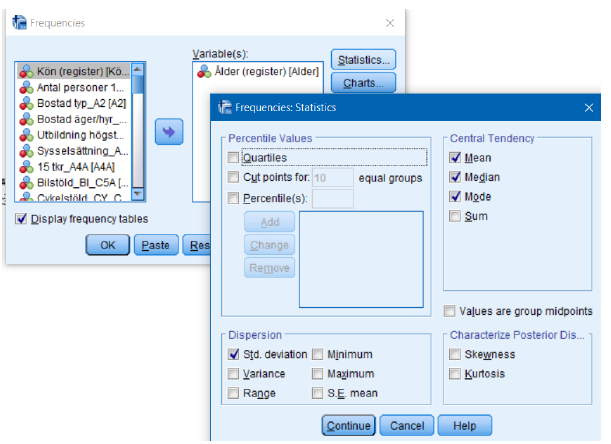

# (PART\*) Dataövningar {-}

# Dataövning 0

Följande kommer att beröras i dataövningen

- Att öppna och använda befintliga datamaterial i SPSS
- Att genomföra univariata analyser med frekvensfördelningar samt centralmått
- Grafisk framställning av data

 
<b>Uppgift 1</b>

Öppna den SPSS fil som innehåller data från den Nationella trygghetsundersökningen för
åren 2013-15,

Välj ”Data View”. Hur många individer ingår i datamaterialet?

Klicka för svar

37 118 individer

 

Välj ”Variable View” (se kapitlet <b>Viktiga fönster i SPSS</b>). Hur många variabler finns i datasetet?

Klicka för svar

52 variabler

 

<b>Uppgift 2</b>

Ta reda på hur åldersfördelningen ser ut samt medelvärde (mean), median (median) och
typvärde (mode) för ålder

- Analyze > Descriptive Statistics > Frequencies
- Välj lämplig variabel för att besvara frågan (Alder)
- Klicka på Statistics och välj centralmått (mått på centraltendens)
- Markera att du vill ha en frekvenstabell

För vägledning se nedan

Vilket är åldersintervallet för dem som deltagit i studien?

Klicka för svar

16-79 år

 

Vilken är medelåldern?

Klicka för svar

45,86 år

 

Är något av de tre centralmåtten sämre på att uttrycka centraltendens? I så fall varför?

Klicka för svar

Typvärdet är sämre mått för att beskriva centraltendensen i denna fördelning. Det är tydligt att typvärdet avviker kraftigt från medelvärde och median vilket beror på att fördelningen inte är normalfördelad utan snarare bimodal med en överrepresentation av unga vuxna (omkring 16-29) och äldre (omkring 75-79).

 

<b>Uppgift 3</b>

Flera frågor i NTU avser utsatthet för personbrott, två av dessa frågor gäller våld respektive
hot.

- C10: ”Slog, sparkade eller utsatte någon dig med avsikt för något annat fysiskt våld, så att du skadades eller så att det gjorde ont, under förra året?”
- C12: ”Blev du under förra året hotad på ett sådant sätt, att du blev rädd?”

Ta reda på hur stor andel som har varit utsatt för våld respektive hot.

- Analyze > Descriptive Statistics > Frequencies

Hur stor andel har uppgett att de utsatts för våld?

Klicka för svar

2,1% uppger sig ha varit utsatta för våld

 

Hur stor andel har uppgett att de utsatts för hot?

Klicka för svar

4,2% uppger sig ha varit utsatta för hot

 
