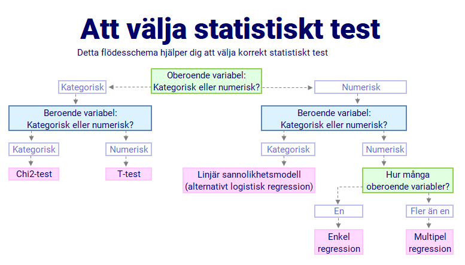

# (PART\*) Analysera data III: Hypotesprövning  {-}

# Att välja rätt test vid hypotesprövning

Samhällsvetare arbetar nästan alltid med urval dragna ur en population men vill generalisera till hela
populationen. Den gren inom statistik som hjälper oss att göra detta kallas statistisk inferens.
Arbetsgången att pröva de samband vi är intresserade av är att ställa upp nollhypotes och mothypotes,
där nollhypotesen uttrycker att det inte finns en skillnad medan mothypotesen uttrycker att det finns
en skillnad. Det vi prövar är något förenklat om skillnaderna och de samband vi undersöker är tillräckligt
stora för att kunna antas gälla i populationen. Om så är fallet förkastar vi nollhypotesen.

Vilket statistiskt test man behöver använda för att utföra en hypotesprövning bestäms helt utifrån de variabler man använder sig av.
Listan på vilka statistiska test som finns att tillgå är lång men det finns några få som förekommer ofta och  som är praktiska att känna till 
eftersom de underlättar förståelsen för andra statistiska test. Med hjälp av nedanstående flödesschema kan ni avgöra vilket statistiskt test som lämpar sig bäst för de variabler som ni önskar att analysera.

