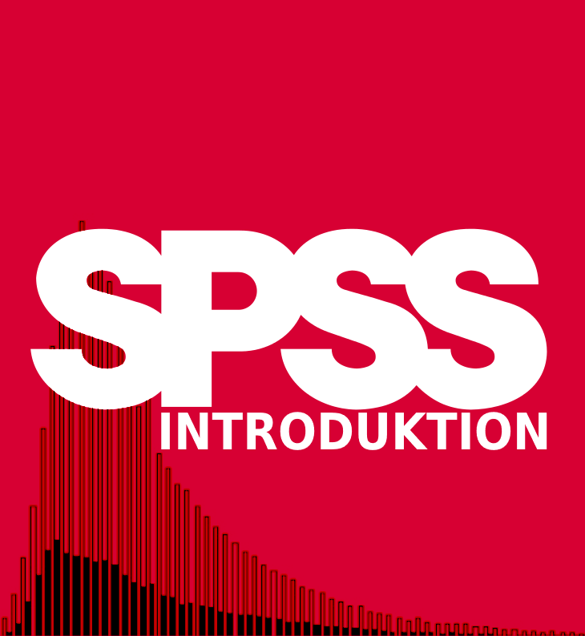

--- 
title: "SPSS introduktion"
author: "Enes Al Weswasi, Olof Bäckman, Anders Nilsson och Fredrik Sivertsson"
date: "2022-07-25"
knit: "bookdown::render_book"
site: bookdown::bookdown_site
output: bookdown::bs4_book
documentclass: book
bibliography: [book.bib, packages.bib]
suppress-bibliography: true
colorlinks: yes
graphics: yes
description: "Denna SPSS-introduktion är avsedd för dig som läser kursen Metod 2 på Kriminologiska institutionen vid Stockholms universitet. Introduktionen inleds med en SPSS-guide som rymmer en genomgång av SPSS olika fönster, hur man lägger in data och hur man öppnar en redan befintlig datafil. Därefter följer grundläggande tillvägagångssätt för bearbetning och beskrivning av data (beskrivande statistik). Guiden avslutas med en genomgång av några grundläggande analysmetoder för bivariata och multivariata samband."
url: https://spss-introduktion.netlify.app/
github-repo: "weswasi/spss_intro"
cover-image: "images/SPSS_intro.png"
---

# Om SPSS Introduktion {-}

Denna SPSS-introduktion är avsedd för dig som läser kursen Metod 2 på Kriminologiska institutionen vid Stockholms universitet. Introduktionen inleds med en SPSS-guide som rymmer en genomgång av SPSS olika fönster, hur man lägger in data och hur man öppnar en redan befintlig datafil. Därefter följer grundläggande tillvägagångssätt för bearbetning och beskrivning av data (beskrivande statistik). Guiden avslutas med en genomgång av några grundläggande analysmetoder för bivariata och multivariata samband.

De tre dataset som vi kommer att jobba med finns på kurssajten På Athena. Det första datasetet är Brottsförebyggande rådets skolundersökning 2005. Det andra datasetet är en fil baseras på fem årgångar (2017-2021) av Brottsförebyggande rådets Nationella trygghetsundersökning. Det tredje och sista datasetet är från en amerikansk självdeklarationsstudie vid namn Pathways to desistance innehållande uppgifter från 1 300 brottsbelastade ungdomar. Observera att dessa filer enbart är till för att användas på denna kurs. Efter kursens avslutande ska alla eventuella lokala kopior raderas. En kortare beskrivning av dessa datamaterial finns med som bilaga i slutet av denna guide. För mer utförliga beskrivningar hänvisas till de Brå-rapporter som finns på Athena samt Pathways to desistance-artikeln.

SPSS-guiden ger en introduktion till att arbeta med SPSS Version 28 vilket är den senaste versionen och som vi rekommenderar att ni använder. Några mer ingående redogörelser av statistiska metoder ges inte, för sådana får ni gå till kurslitteraturen. Ni får här inte heller någon utförlig beskrivning av datamaterialen som används på kursen. Sådan information hittar ni via Athena.

Dataövningarna under kursen gång ger ytterligare träning i att använda SPSS. Uppgifterna till dataövningarna hittar ni i anslutning till repsktive dataövnings planering i Athena. Här finns också korta introduktionsfilmer till uppgifterna.
