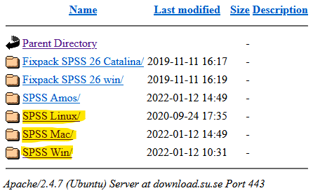
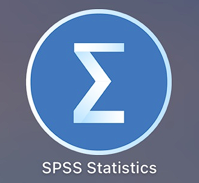
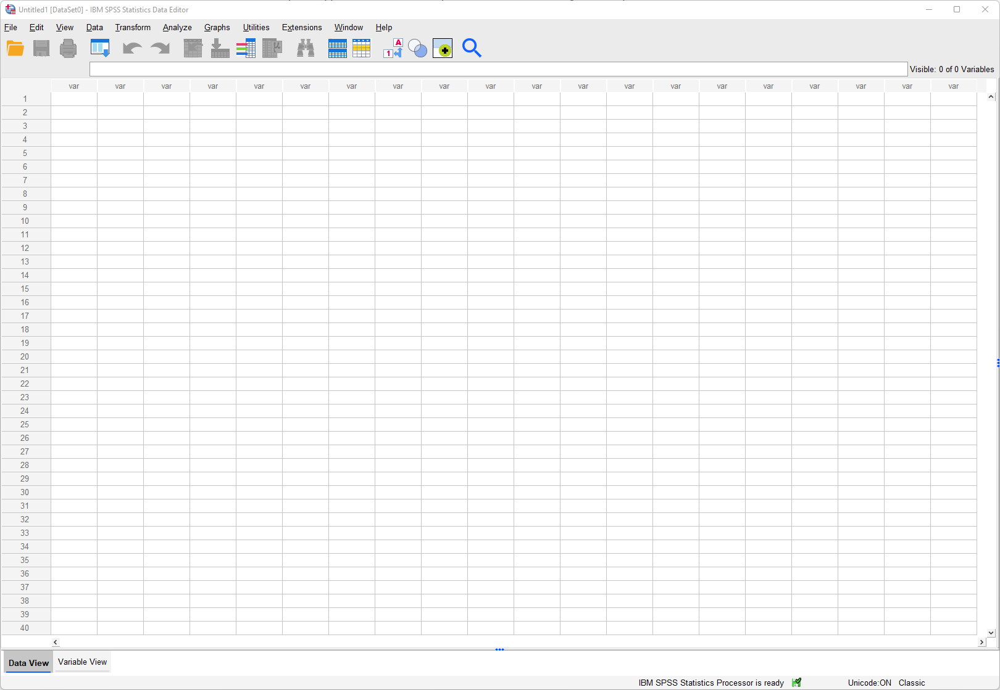
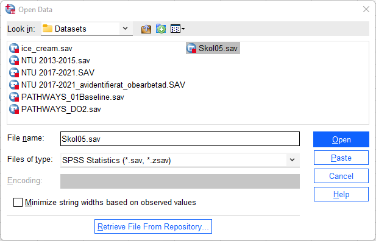

# (PART\*) Komma igång med SPSS {-}

# Installera och starta SPSS

## Ladda ner SPSS

Nedanstående instruktioner är hämtade från <a href="https://www.su.se/utbildning/it-f%C3%B6r-studenter/licenser-och-program/spss-1.445813">Stockholms universitets sida om SPSS</a>. Om någon länk ej fungerar så pröva att besök SU:s SPSS-sida. Där hittar ni även information om hur man avinstallerar SPSS eller förnyar licensnyckeln.

1. Börja med att klicka in er till <a href="https://download.su.se/student/SPSS_AMOS/Installationsfiler/">sidan för installationsfiler för SPSS</a>.

2. Välj vilket operativsystem du vill installera SPSS på. SPSS finns till Windows, Mac, och Linux. Observera att SPSS inte finns till Chromebook.

3. Olika versioner av SPSS finns tillgängliga men vi rekommenderar version 28 eftersom "SPSS Introduktion" är anpassad efter denna version. Välj vilken version du vill installera (samt om du kör x32 eller x64 på Windows) > Klicka på .exe- .pkg-, respektive .dmg-filen > Välj Spara fil/Save File.

4. För SPSS på Windows, finns ZIPade installationsfiler. Spara ner den ZIPade filen på skrivbordet > högerklicka på mappen och välj Extract All > välj Extract > dubbelklicka på setup.exe > välj Run.

## Installera SPSS

1. Gå igenom installations-wizarden.

- Om du får ett val mellan Authorized user license och concurrent user license > välj Authorized user license.

- Om du ska ange Organization > skriv Stockholms universitet.

2. När du har gått igenom wizarden > välj Install (detta kan ta några minuter).

3. När installationen är genomförd > välj License Product. Du kommer att se en lista på de applikationer som är temporärt licensierade i 14 dagar. Klicka på Next > se till att alternativet Authorized User License är valt > välj Next.

4. För att få åtkomst till aktuella behörighetskoder, <a href="https://download.su.se/student/SPSS_AMOS/">klickar du här</a>. Klistra in koden för den version du har valt att licensiera > välj Next. Du ser nu en progressruta och denna avslutas med **End of Transaction** Successfully processed all codes > välj Next. Du ser nu en ruta som bekräftar de licensierade modulerna. Klicka på Finish för att avsluta licensieringen.

5. Verifiera installationen genom att kontrollera att det går bra att starta programmet.

## Starta SPSS

Öppna SPSS genom att dubbelklicka på ikonen på skrivbordet eller gå via starmenyn När du öppnar SPSS kommer du att, som på bilden nedan, se en datamatris – ett rutnät bestående av rader och kolumner.

Raderna i denna matris motsvarar observationsenheter (t.ex. individer) medan kolumner motsvarar variabler (t.ex. frågor i en surveyundersökning). 

Om du vill öppna ett befintligt dataset väljer du:

1. File > Open > Data
2. Hitta datafilen i katalogen och välj **Open**
3. I exemplet nedan öppnas filen Skol05.sav från datorns skrivbord

