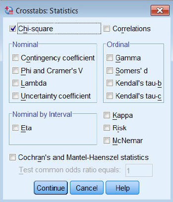
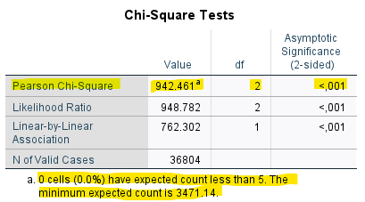

# Chi2-test

I exemplet ovan kunde vi se att oro för brottsligheten i samhället skiljer sig för män och kvinnor. Utifrån
vår korstabell kan vi dock endast uttala oss om förhållandet i urvalet. Vad vi nu vill ta reda på är om detta
samband mellan kön och oro för brottsligheten är tillräckligt tydligt för att kunna antas gälla i
populationen, dvs. i befolkningen. Eftersom vi har två kategoriska variabler är chi2 ett lämpligt
signifikansmått. Proceduren i beräkningen av chi2 är att jämföra observerade frekvenser med de
frekvenser som skulle förväntas om det inte fanns någon skillnad. Genom denna jämförelse får vi fram
ett chi2-värde som vi i nästa steg kan jämföra med en så kallad chi2-fördelning för att ta reda på
huruvida detta värde överstiger ett kritiskt värde som motsvarar en given signifikansnivå. Genom denna
procedur skulle vi utifrån vår korstabell kunna räkna ut huruvida sambandet är signifikant eller inte,
men som tur är har vi SPSS till vår hjälp. Arbetsgången är följande:

Analyze > Descriptive statistics > Crosstabs

Välj precis som tidigare att placera ”kön” i kolumnled och ”S4” i radled. Välj även, precis som tidigare,
att sammanställa korstabellen med kolumnprocent under alternativet ”Cells”. Klicka därefter på
”Statistics” och markera alternativet ”Chi-square”. Klicka på ”Continue” och därefter ”OK”. Utöver korstabellen får du nu även en tabell som ger
information om ditt begärda Chi2-test.

Titta på raden ”Pearson Chi-Square” och kolumnen ”Asymp. Sig. (2-sided)”. Här kan du se att ditt pvärde
är mindre än 0.01. Skillnaderna är alltså så pass stora att dessa på en procents signifikansnivå kan
antas gälla i populationen. Observera att du även har ett stort antal observationer, vilket även det har
betydelse för dina möjligheter att finna skillnader som går att generalisera (gör att du får ett högre Chi2
värde). Sambandet är signifikant på en procents signifikansnivå och vi kan alltså generalisera våra
resultat till att gälla för hela populationen.

Observera dock att SPSS anger att 0 celler har förväntade värden som understiger fem. Som regel gäller
att Chi2-testet är ogiltigt om 20% av cellerna har ett förväntat värde mindre än 5 eller en cell har ett
förväntat värde mindre än 1 då korstabellen är större än 2x2. Om korstabellen är 2x2 får ingen av
cellerna ha ett förväntat värde som är mindre än 5. I detta fall är dock signifikanstestet giltigt. Om chi2-
testet skulle visa sig vara ogiltigt kan lösningen vara att klassindela sina variabler med hjälp av
kommandot Recode (se ovan under avsnittet Databearbetning).

<iframe id="kaltura_player" src="https://api.kaltura.nordu.net/p/365/sp/36500/embedIframeJs/uiconf_id/23452190/partner_id/365?iframeembed=true&playerId=kaltura_player&entry_id=0_5ww1otji&flashvars[streamerType]=auto&amp;flashvars[localizationCode]=sv_SE&amp;flashvars[leadWithHTML5]=true&amp;flashvars[sideBarContainer.plugin]=true&amp;flashvars[sideBarContainer.position]=left&amp;flashvars[sideBarContainer.clickToClose]=true&amp;flashvars[chapters.plugin]=true&amp;flashvars[chapters.layout]=vertical&amp;flashvars[chapters.thumbnailRotator]=false&amp;flashvars[streamSelector.plugin]=true&amp;flashvars[EmbedPlayer.SpinnerTarget]=videoHolder&amp;flashvars[dualScreen.plugin]=true&amp;flashvars[hotspots.plugin]=1&amp;flashvars[Kaltura.addCrossoriginToIframe]=true&amp;&wid=0_42gfduxa" width="608" height="402" allowfullscreen webkitallowfullscreen mozAllowFullScreen allow="autoplay *; fullscreen *; encrypted-media *" sandbox="allow-forms allow-same-origin allow-scripts allow-top-navigation allow-pointer-lock allow-popups allow-modals allow-orientation-lock allow-popups-to-escape-sandbox allow-presentation allow-top-navigation-by-user-activation" frameborder="0" title="Kaltura Player"></iframe>
