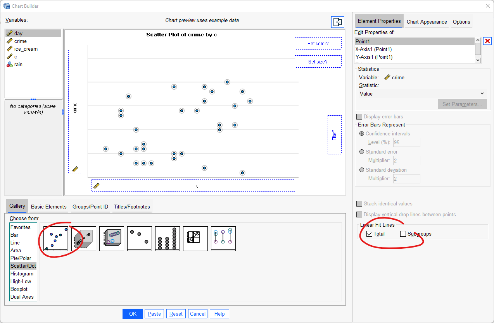
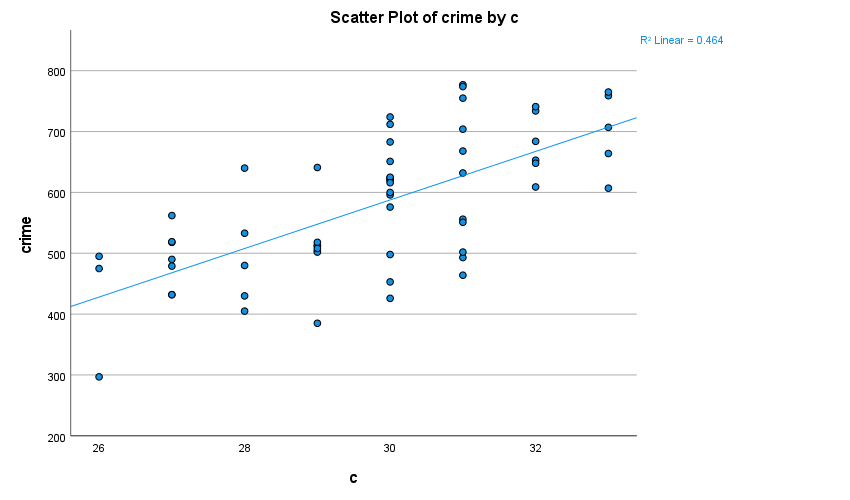
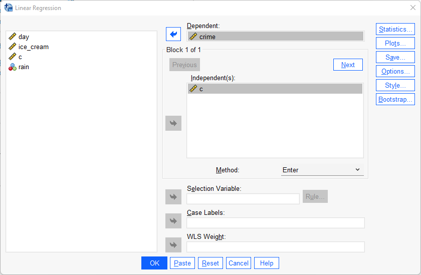
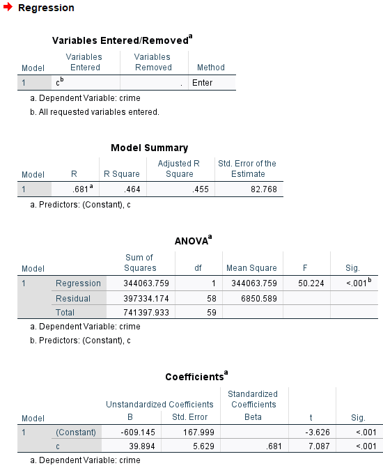
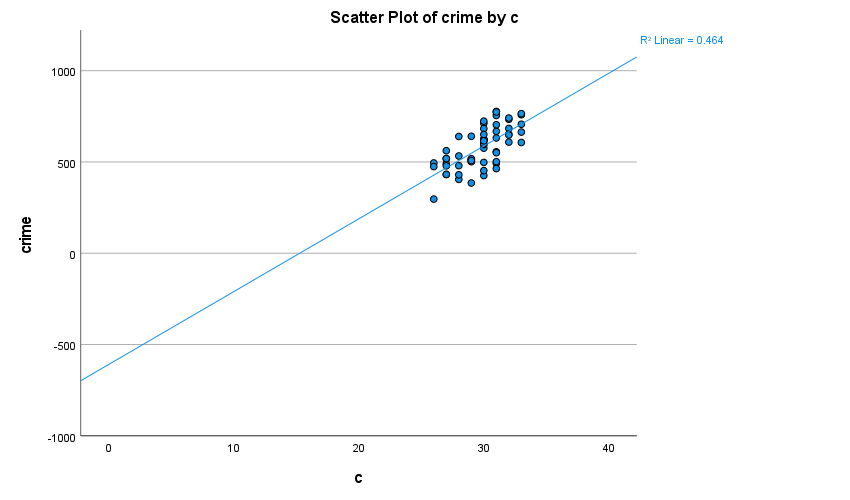

# Enkel regression

I nästa steg är vi intresserade av att se sambandet mellan två numeriska variabler. Eftersom vi enbart använder oss av två variabler och båda är numeriska är enkel regression ett lämpligt statistiska test. Med hjälp av enkel regression kan vi <i>predicera</i> värden eller utröna vilken effekt en variabel har påen annan. Vad det innebär att predicera och hur effekter redogörs kommer att exemplifieras här nedan.

Vi är intresserade av att se vilket samband det finns mellan utomhustemperatur (oberoende variabel) och antal anmälda brott i Stockholm (beroende variabel). Ett annat sätt att formulera forskningsfrågan är om vi kan predicera polisanmäld brott utifrån utomhustemperatur. 

Vår regressionsmodel kan uttryckas i form av följande matematiska formel: 

$Y_{brott} = b_0 + b_{celcius}$
 

Det vår modell säger är att vikan predicera polisanmälda brott utifrån vårt intercept/konstant (b0) och utomhustemperaturen.

Hypotesen är - utifrån rutinaktivitetsteorin - att ju varmare det är, desto fler personer vistas utomhus vilket leder till fler brottstillfällen. Datamaterialet vi använder för denna forskningsfråga är materialet från det fiktiva datasetet som innehåller uppgifter om glassförsäljning, anmälda brott, utomhustemperatur och förekomsten av regn (ice_cream.sav). 

Det första vi gör är att ta fram ett spridningsdiagram (<i>scatter plot</i>) med en regressionslinje. Hur man tog fram ett spridningsdiagram gick vi igenom under kapitlet som berörde bivariat analys men här kommer en repetition. Gör följande:

Graphs > Chart builder

Under ”Gallery”, klicka på ”Choose from”, välj ”Scatter / Dot” och dra ”Simple Scatter” upp till rutan ”Chart Preview”. Dra din oberoende variabel till rutan för x-axeln och din beroende variabel till rutan för y-axeln. Klicka i <b>Total</b> under Linear Fit Lines för att inkludera en regressionslinje till din figur. Klicka därefter ”OK”. 

Som vi kan se med hjälp av regressionslinjen i spridningsdiagramet så verkar det finnas i vårt datamaterial ett starkt positivt samband mellan utomhustemperatur och polisanmäld brottslighet; ju varmare det är desto fler brott polisanmäls.

Frågan är dock om vi kan generalisera detta samband eller om det kanske kan ha uppstått av ren slump. Detta kan vi avgöra med hjälp av en regressionsanalys. Gör följande:

Analyze > Regression > Linear

I rutan som dyker upp matar ni in den oberoende variabeln - utomhustemperatur - i fältet Block 1 of 1 
och den beroende variabeln - polisanmälda brott - i fältet Dependent. Tryck därefter ok.

Vi kan utifrån ovanstående resultat se flera saker värda att notera. Vi börjar med informationen i rutan "Model Summary". De mått som där är viktigast att titta på är Square R och Adjusted  R Squared. Det anger hur stor andel varians/variation i vår beroende variabel som vår oberoende kan förklara. Det vill säga, hur stor andel variation i polisanmälda brott från dag till dag kan förklaras utifrån uthomhustemperaturen. Skillnaden mellan R Square och Adjusted R Square” är att det sistnämnda  måttet tar hänsyn till antalet oberoende variabler som ingår i ens regression. Om man inkluderar många oberoende variabler kan ”R Square” överskatta den förklarade variansen och därför brukar man generellt använda sig av Adjusted R Square när man har fler än en oberoende variabel.

Eftersom vi enbart har en oberoende variabel så tittar vi på R Square vilket visar att 46.4% (översätter man andelen 0.464 till procent blir det 46.4%) av variationen i polisanmäld brott kan förklaras med hjälp av vår oberoende variabel utomhustmperatur. 

I ANOVA-rutan kan vi se att vår regressionsmodell är statistisk signifikant p < 0.001 (skall ej förväxlas med den enskilda  oberoende variablelns p-värde!). Det betyder att vår regressionsmodell innehållande en oberoende variabel hjälper oss att förstå den beroende variabeln bättre än enbart informationen från en modell utan en oberoende variabel (det vill säga utifrån enbart informationen om genomsnittlig antal polisanmälda brott).

Den absolut viktigaste rutan är Coefficiens-rutan vilket visar vilken effekt den oberoende variabeln har på den beroende och om denna effekt är signifikant. Vi borjar dock först med att titta på Constant vilket är vår intercept och dess koefficient vilket går att utläsa under Unstandardized B. I vårt exempel kan vi se att interceptet är -609.145. Det betyder att det predicerade värdet för vår beroende variabel är -609.145 när vår oberoende variabel antar värdet 0. Eller mer specifikt uttryckt: när utomhustemperaturen är noll grader begås det -609 brott.

**Överkurs:**
Även om interceptet är matematiskt korrekt så kan den vara orealistisk. I vårt exempel är det ett intercept som är mindre realistisk eftersom vi vet att även vid noll grader så begås det brott. Den orsak till varför vi får ett osannolikt intercept (men som är matematisk korrekt!) är att vi enbart samlat in data under sommaren och inte under vinterhalvåret. Vår modell försöker så gott det går att predicera hur det skulle se ut vid noll grader men eftersom vi saknar data för höst och vinter så ger modellen oss icke-realistiska värden. Detta är dock inget problem eftersom vi är ute efter att se sambandet mellan utomhustemperatur och brott <b>under sommaren</b>

Interceptets värde kan vi också se i ovanstående spridningsdiagram om vi anger att diagramets x-axel ska börja på 0 celsius. Nedanstående spridningsdiagram är identiskt med ovansående men med enda skillnaden att x-axeln börjar på 0 celcius. Notera att vi ine har förändrat något beträffande vår data utan endast förlängt diagramets x-axel. Vi kan där se att interceptet - det vill säga där regressionslinjen korsar Y-axeln - är vid -609.145.

Vidare kan vi se att koefficienten för vår oberoende variabel är 39.894 och under Sig. kan vi se att vårt p-värde är mindre än 0.001. Det betyder att för varje enhets ökning av temperaturvariabeln (alltså för varje temperaturgrads ökning) så ökar antalet polisanmälda brott med 39.894 och eftersom p-värdet är mindre än 0.05 (vilket är vårt alfavärde) så är denna effekt statistiskt signifikant.

Med hjälp av ovanstående information kan vi predicera hur många brott som kommer polisanmälas under en dag då det exempelvis är 25 grader utomhus. För att göra det tar vi vårt intercept, adderar därefter produkten av koefficenten för vår oberoende variabel och 25 (vilket är den temperatur som vi exemplefierar med).

$Y_{brott} = b_0 + b_{celcius}$
 

$Y_{brott} = -609.145 + (39.894*25)$
 

$Y_{brott} = 388.205$
 

Vi predicerar alltså att det i genomsnitt kommer polisanmälas 388 brott under en dag då utomhustemperaturen är 25 grader.