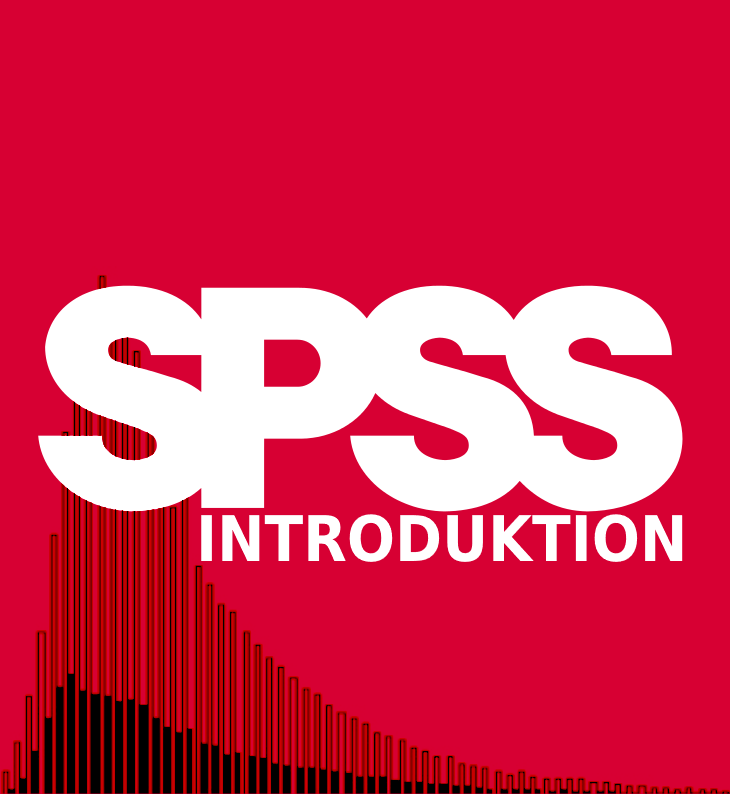
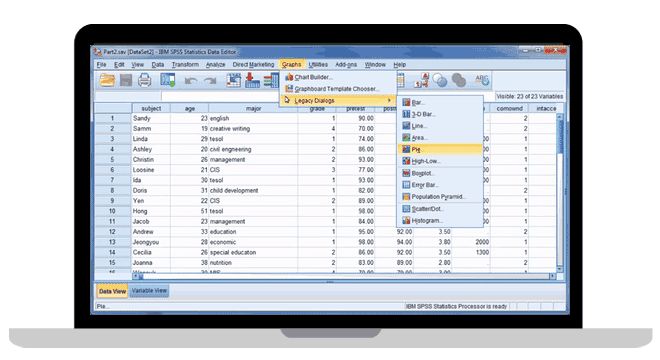

--- 
title: "SPSS introduktion"
author: "Enes Al Weswasi, Olof Bäckman, Anders Nilsson och Fredrik Sivertsson"
date: "`r Sys.Date()`"
knit: "bookdown::render_book"
site: bookdown::bookdown_site
output: bookdown::bs4_book
documentclass: book
bibliography: [book.bib, packages.bib]
suppress-bibliography: true
colorlinks: yes
graphics: yes
description: "Denna SPSS-introduktion är avsedd för dig som läser på Kriminologiska institutionen vid Stockholms universitet."
url: https://spss-introduktion.netlify.app/
github-repo: "weswasi/spss_intro"
cover-image: "images/SPSS_intro.png"
---

```{r include=FALSE}
# automatically create a bib database for R packages
knitr::write_bib(c(
  .packages(), 'bookdown', 'knitr', 'rmarkdown'
), 'packages.bib')
```

# Om SPSS Introduktion {-}

<b>LÅNGT IFRÅN FÄRDIG - UNDER KONSTRUKTION</b>

<p>Denna SPSS-introduktion är avsedd för dig som läser på Kriminologiska institutionen vid Stockholms universitet. Guiden innehåller alla de moment i SPSS för att kunna pröva hypoteser och besvara frågeställningar. Tanken är att ni ska nyttja denna sida när ni utför de dataövningar som de kvantitativa metodkurserna tillhandahåller.

På vänster sida har nu de olika teman som guiden består av. Samtliga guider innehåller instruktioner i textformat men även videoinstruktioner finns i respektive kapitel med alla de steg som beskrivits i texten.</p>
<br>
Första temat rymmer en genomgång hur man installerar SPSS och öppnar ett dataset. Därefter följer en genomgång av SPSS olika fönster. Nästa tema ger grundläggande tillvägagångssätt för bearbetning av data. Därefter kommer första temat för dataanalys vilket består av en genomgång om hur man tar fram deskriptiv statistik. Andra temat av dataanalys består av en genomgång av sambandsanalys av två variabler. I det sista temat om datanalys preseneras en rad analysmetoder för bivariata och multivariata samband. Guiden avslutas med en genomgång hur man bearbetar figurer och tabeller så att de blir presentationsdugliga samt en presentation av de dataset några av de dataset som finns att tillgå.

SPSS introduktion ger en guide till att arbeta med SPSS Version 28 vilket är den senaste versionen och som vi rekommenderar att ni använder. Tidigare versioner av SPSS kan avvika något gälland tillvägagångsätten för vissa av de instruktioner som här presenteras.

<center></center><br>

Om ni hittar något fel eller har förbättrningsförslag får ni mer än gärna mejla de till <a href = "mailto: enes.al.weswasi@criminology.su.se">enes.al.weswasi@criminology.su.se</a>.
