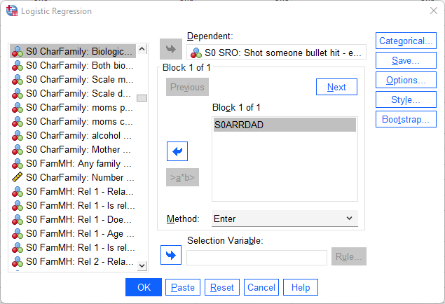
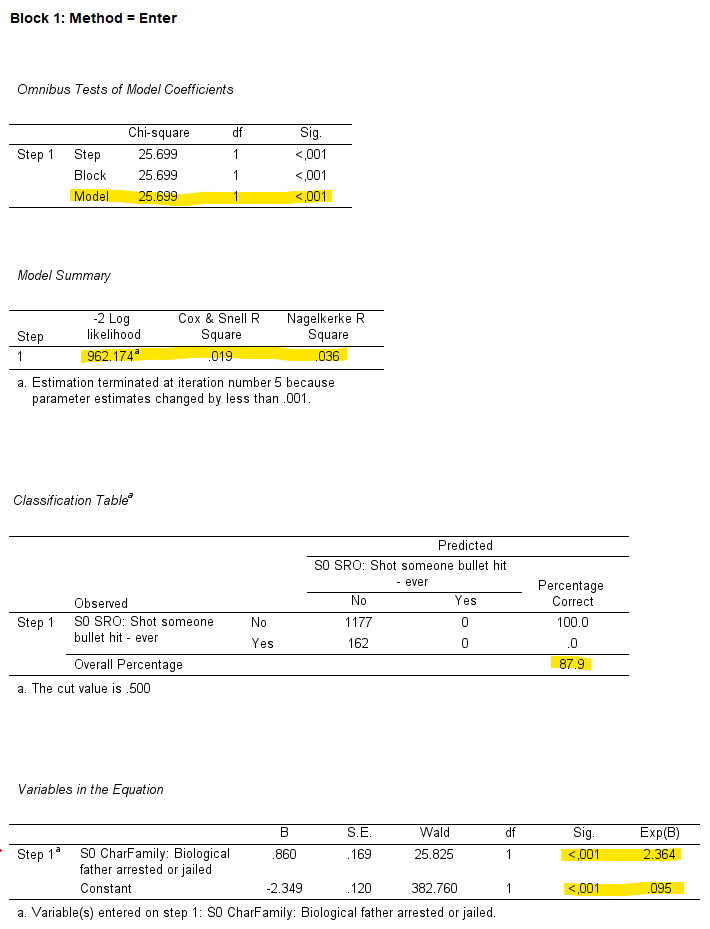
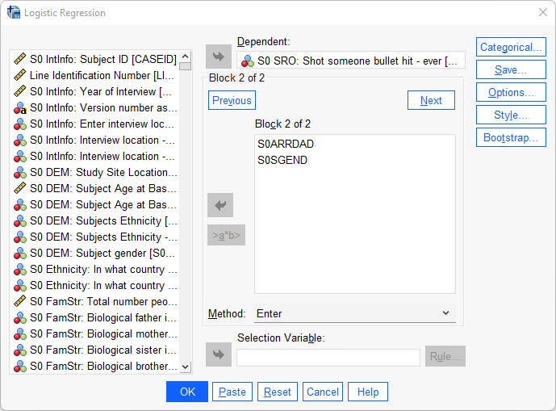
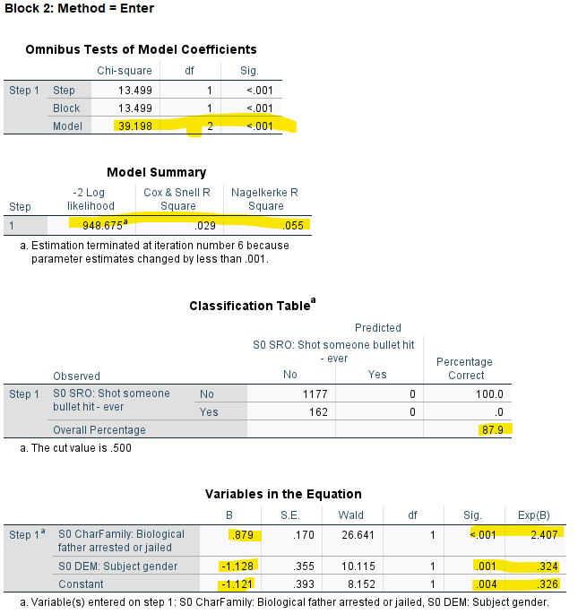

# Logistisk regression

När den oberoende variabel är numerisk och den beroende variabel dikotom och således enbart kan anta två värden har man traditionellt använt sig av analysmetoden logistisk regression.
Här nedan följer först instruktioner hur man utför en enkel logistisk regression och som sedan följs upp av instruktioner hur man genomför en multipel logistisk regression.

## Enkel logistisk regression

I detta exempel kommer att använda oss av Pathways to desistance-datasetet. Den frågeställning vi ställer är följande: Finns det ett samband mellan att ha skjutit en annan person och att ha en pappa som lagförts för ett brott?" Ett annat sätt att formulera frågan är: Kan vi predicera huruvida en individ har skjutit en annan person utifrån information om faderns lagföringshistorik? Den beroende variabeln är dikotom och kan anta värdet 0 om individen ej har skjutit en annan person och 1 om personen tidigare har skjutit en annan person. Den oberoende variabeln antar värdet 0 om personens fader aldrig tidigare lagförts för ett brott och 1 om fadern har tidigare lagförts för ett brott. För att genomföra den enkla logistiska regressionen gör ni som följande:

Analyze > Regression > Binary Logistic

Därefter placerar ni den beroende variabeln - skjutit en annan person - i Dependent-fältet och den oberoende variabeln - lagförd fader -  i Covariates-fältet.

Inte helt oväntat kommer ni få ut en rad olika rutor med en mängd information. Vi tar en i taget. Rutan Case Processing Summary ger er deskriptiv information om hur många individer som förekommer i analysen samt hur många som är missing. I rutan Dependent Variable Coding framgår det hur SPSS har valt att koda om den beroende variabeln så att den verkligen enbart antar värdena 0 och 1. Därefter kommer rad rutor under Block 0: Beginning Block. Block 0 är den logistiska modellen utan en oberoende variabel. Det vill säga en modell med enbart interceptet (och dess information om individen skjutit någon eller ej). Vi kan hoppa över hela Block 0 eftersom ingen information där är av intresse för oss.

Under Block 1: Method = Enter börjar det bli lite intressantare. Under Omnibus Tests of Model Coefficients och det tillhörande P-värdet för Model hittar ni information om vår angivna modell presterar bättre än en modell utan vår oberoende variabel. Det motsvarar informationen i ANOVA-rutang ällande f-färdet och p-värdet för regressionsmodellen när ni utför en regressionsanalys (se kapitlet om enkel och multipel regression). Vi kan i vårt fall se att vår modell är signifikant. Under Model Summary hittar ni information om hur pass bra er logistiska modell passar er data.  Cox & Snell R Square  och Nagelkerke R Square är så kallade pseudo-R2 som ska efterlikna R2-värdet man får ut när man genomför en regressionanalys. Värdena för pseudo-R2 kan dock inte tolkas som estimat för förklarad varians. Enklast är istället att tänka att värdena kan gå från 0 till 1 och att höga värden indikerar att de oberoende variablerna är bättre på att predicera den beroende variabeln. I vårt fall har vi överlag ganska låga värden vilket betyder att även om den kan hjälpa oss predicera den beroende variabel så är dess prediktiva förmåga låg. -2 Log Likelihood är lite svårare att tolka men enkelt uttryck kan man säga att ju lägre värde desto bättre.

Under Classification Table hittar ni information om hur ofta (uttryckt i procent) som vår modell lyckades predicera rätt att en individ skjutit en annan person (alternativt ej) utifrån information om faders tidigare lagföring. Vår modell lyckades pricka rätt 87,9 % av fallen. Även om denna siffra är hög så ska det dock noteras att vår modell lyckades inte predicera att någon av våra individer som skjutit en annan person trots att vi faktiskt har 162 individer som gjort det. Det går att förklara med kombinationen att det är förhållandevis få som skjutit en annan person och det faktu att vi har en oberoende variabel som har en låg prediktiv förmåga. 

Nu kommer vi äntligen till den viktigaste rutan: Variables in the Equation. Här ser vi information gällande vår hypotesprövning så som vilken effekt vår oberoende variabel har på vår beroende samt om denna effekt är statistisk signifikant. När vi utför en logistisk regression uttrycks betakoefficienten i termer av så kallade logaritmerade oddskvoter (<i>log odds ratios</i>). Att tolka logaritmerade värden är minst sagt krångligt så därför brukar man ta exponenten av de logaritmerade värdena så att man får ut icke-logaritmerade betakofficienter. Dessa värden hittar ni under Exp(B). Enklaste sättet att tolka dessa koeffeicitenter är att värden som överstiger 1 visar positiva samband och värden som understiger 1 visar negativa samband. Ett värd på 1 visar inget samband alls. Eftersom vår oberoende variabeln har koefficienten 2.364 så har vi ett positivt förhållande: det finns ett samband mellan att ha en lagförd fader och att ha skjutit en annan person. Eftersom p-värdet är < .001 är detta samband statistiskt signifikant.

**Överkurs:** Även om icke-logaritmerade oddskvoter är enklare att tolka än logaritmerad så är estimaten fortfarande något krångliga att förstå. Vad betyder det exempelvis att vår oberoende variabel har värdet 2.364? Eller för den delen att konstanten är .095? 

Konstanten är som vi alla vet de vars värde på de eller den oberoende är noll.  Variabeln i vårt fall är de vars far ej lagförts för ett brott. Oddset för att ha skjutit en annan person är därför 0.095 för de som ej har en far som tidigare lagförts. Eftersom 0.095 är cirka en tiondel av 1 kan vi säga att det är nära tio gånger lägre odds att en individ med en icke-lagförd fader ej skjutit någon än ha gjort det. Vad säger då vår oberoende variabel med värdet 2.364? Jo, den beskriver att oddset att ha skjutit någon är 2.364 gånger högre för en individ vars fader är lagförd än en individ vars fader ej är lagförd.

Av pedagogiska skäl har vi som sagt valt en dikotom oberoende variabel men hur skulle man tolka koefficienten om den var kontinuerlig istället? Säg att den oberoende variabeln var faderns inkomst uttryckt i dollar per månad och att koefficienten fortfarande är 2.364. Koefficienten hade då tolkats som den genomsnittliga förändringen i odds per en enhets ökning. Så en individ vars far har en lön på 1000 dollar per månad har 2364 högre odds (2.364x1000) att ha skjutit någon än en individ fars far har 0 i inkomst (ja, jätteorealistiskt exempel men vi kör på detta av pedagogiska skäl).

## Multipel logistisk regression

Nu är det dags att inkludera en ytterligare variabel till vår modell. Kan det kanske teoretiskt vara så att det finns en viss könsskillnad i den effekt som faderns lagföring har på risken att ha skjutit någon annan? Det kanske är så att pojkar löper högre risk eftersom det teoretiskt kan vara så att pojkar tar efter sin fader i högre utsträckning än flickor gör. För att justera/kontrollera för denna effekt inkluderar vi därför variabeln kön i vår modell. Vi gör i princip på samma sätt som tidigare:

Analyze > Regression > Binary Logistic

Vi börjar med att placerar vår beroende varibel - skjutit annan person - i Dependent-fältet. För att kunna se hur vår koefficient för lagförd fader förändras när vi går från en enkel till multipel logistisk regression så väljer vi att ha två modeller. Börja med att placera enbart den oberoende variabeln lagförd fader i Block 1-rutan. Tryck sedan på next och lägg på nytt den oberoende variabeln lagförd fader i rutan som nu dock heter Block 2. Placera därefter även in den obeoende variabeln kön i samma ruta. Tryck därefter på OK.

Precis som tidigare så får vi en uppsjö av rutor och denna gången även fler. Vi hoppar direkt ner till Block 1: Method = Enter (eftersom de föregående rutorna har vi samtliga redan gått igenom). Denna ruta är vår enkla logistiska regression och är således identisk med den som vi utförde här ovan. Alla värden ska vara identiska som i den enkla logistiska regressionen. Eftersom inget har förändrats här så går vi raskt över till Block 2: Method = Enter vilket är vår multipla logistiska regressions som innehåller modellen med våra två oberoende variabler.

