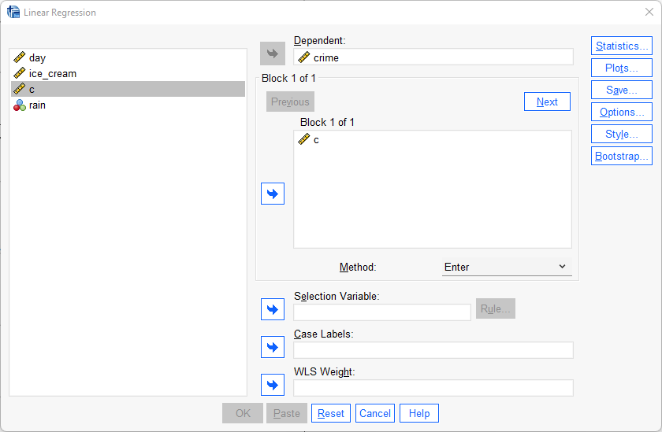
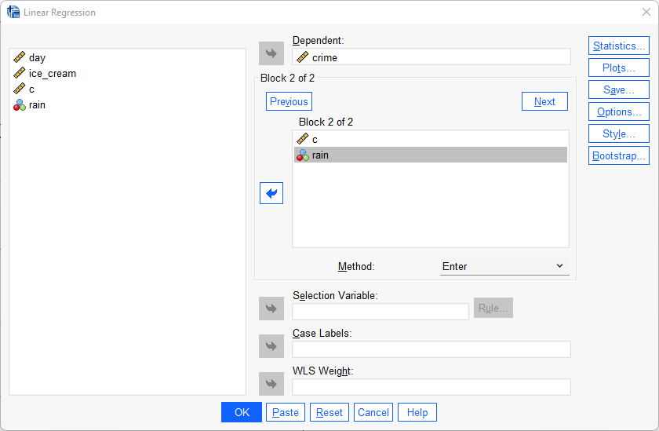
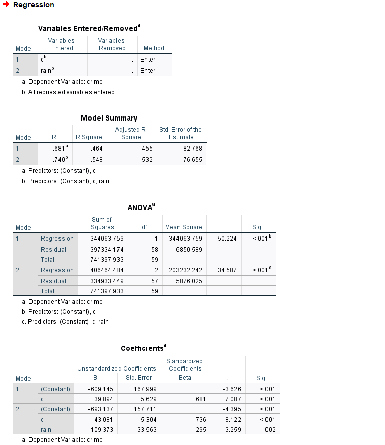

# Multipel regression

Som vi såg i vårt förra exempel så fann vi ett statistiskt signifikant samband mellan utomhustemperatur och polisanmäld brott samt att vår enkla regressionsmodell kunde förklara 46% av variationen av polisanmäld brottslighet. Även om denna siffra är hög så kan vi tänka oss att det finns ytterligare faktorer som möjligtvis kan förklara varför brottslighet varierar från dag till dag. En sådan faktor är om det regnar utomhus. Därför kommer vi att inkludera en kontrollvariabel till vår enkla regression. På så sätt blir det en multipel regression. Variabeln regn är en så kallad dummyvariabel vilket betyder att den kan anta två värden: 1 för dagar det regnar och 0 för dagar då det ej regnar. Vår regressionsmodell kommer då se ut som följande:

$Y_{brott} = b_0 + b_{celcius} + b_{regn}$
 

Det vår modell säger är att vikan predicera polisanmälda brott utifrån vårt intercept (b0), utomhustemperaturen och förekomsten av regn.

Att utföra en multipel regression är snarlikt tillvägagångssättet för en enkel regression. Gör följande:

Analyze > Regression > Linear

Precis som vid en enkel regression så drar vi in vår beroende variabel (polisanmäld brottslighet) till Dependent-fältet. Gör därefter precis som vid den enkla regressionen och dra in den oberoende variaben temperatur till Independents-fältet. 

Tryck därefter på knappen Next. Mata därefter in temperaturvaribeln på nytt och sedan vår kontrollvariabel regn. Tryck därefter på OK.

Vi hade lika gärna kunnat vid första steget mata in båda våra oberoende variabler och inte i två separata "block". Fördelen med att använda blockfunktione är att vi i SPSS först får ut vår enkla regression och därefter i samma ruta den multipla regressionen. Fördelen med detta tillvägagångssätt är att vi kan se hur effekten för vår oberoende variabel av intresse förändras från den enkla regressionen till den multipla regressionen.

Längst ut till vänster i samtliga rutor kan vi se indikatorer på om de olika värdena avser modell 1 (den enkla regressionen) eller modell 2 (den multipla regressionen). Värdena i modell 1 är identiska som i föregående exemplet när vi utförde den enkela regressionen.

Vi börjar med att se hur vårt R Square-värde förändras. Eftersom vi har fler än en oberoende variabel så använder vi oss av värdet från Adjusted R Square vilket är 0.532. Det betyder att våra oberoende variabler kan förklara 53.2% av variationen i vår beroende variabel vilket är en ökning med cirka 7 procentenheter jämfört med vad den enkla regressionen klarade av att förklara.

I Coefficients-rutan och modell 2 kan vi se att konstanthållet för förekomsten av regn så ökar antalet brott med 43.081 för varje enhets ökning av temperaturvariabeln. Under Sig. kan vi se att p-värdet är under 0.001 vilket beyder att sambandet mellan temperatur och brott är statistiskt signifikant även efter inkluderingen av den oberoende variabeln regn.

Vidare kan vi se att koffecienten för den oberoend variabeln regn är -109.373. Det betyder att konstanthållet för den övriga oberoende variabler så begås det 109 färre brott under de dagar det regnar jämfört med regnfria dagar.

Slutligen ska vi försöka predicera antalet brott det anmäls en dag då det är 22 celcius och regnar.

$Y_{brott} = b_0 + b_{celcius} + b_{regn}$
 

$Ŷ_{brott} = -693,137 + (43,081*22) + (-109,373*1)$
 

$Ŷ_{brott} = 274.515$
 

Vi predicerar alltså att det i genomsnitt kommer polisanmälas 274.5 brott de dagar då utomhustemperaturen är 22 grader celcius och regnar.

### Videoinstruktioner

<iframe id="kaltura_player" src="https://api.kaltura.nordu.net/p/365/sp/36500/embedIframeJs/uiconf_id/23452190/partner_id/365?iframeembed=true&playerId=kaltura_player&entry_id=0_xgsht2vp&flashvars[streamerType]=auto&amp;flashvars[localizationCode]=sv_SE&amp;flashvars[leadWithHTML5]=true&amp;flashvars[sideBarContainer.plugin]=true&amp;flashvars[sideBarContainer.position]=left&amp;flashvars[sideBarContainer.clickToClose]=true&amp;flashvars[chapters.plugin]=true&amp;flashvars[chapters.layout]=vertical&amp;flashvars[chapters.thumbnailRotator]=false&amp;flashvars[streamSelector.plugin]=true&amp;flashvars[EmbedPlayer.SpinnerTarget]=videoHolder&amp;flashvars[dualScreen.plugin]=true&amp;flashvars[hotspots.plugin]=1&amp;flashvars[Kaltura.addCrossoriginToIframe]=true&amp;&wid=0_dyujtk6z" width="608" height="402" allowfullscreen webkitallowfullscreen mozAllowFullScreen allow="autoplay *; fullscreen *; encrypted-media *" sandbox="allow-forms allow-same-origin allow-scripts allow-top-navigation allow-pointer-lock allow-popups allow-modals allow-orientation-lock allow-popups-to-escape-sandbox allow-presentation allow-top-navigation-by-user-activation" frameborder="0" title="Kaltura Player"></iframe>
