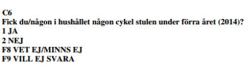

# Presentation av dataset

## NTU 2017-2021
Datasetet <b>NTU 2017-2021 M2.SAV</b> innehåller fem årgångar av NTU och består sammanlagt av 375 590 respondenter. Samtliga individer är anonymiserade vilket innebär att det ej går att härleda vem som förekommer i datamaterialet. Vilka variabler som finns i datamaterialet och hur varje variabel är kodad går att se i <a href="documents/Kodbok NTU 2017-2021.pdf">kodboken för datamaterialet som ni finner här</a>. Detta dokument är viktigt att nyttja i samband med att ni använder datasetet då det inte alltid framgår vad varje variabel betyder och vad dess värden innebär.

Närmare information om urval, datainsamling, frågekonstruktion, kodning och annat relevant återfinns i den
<a href="https://bra.se/download/18.1f8c9903175f8b2aa70111be/1633935949525/2021_Nationella_trygghetsundersokningen_2021_Teknisk_rapport.pdf">tekniska rapporten för NTU 2021 som ni finner här</a>.

## NTU 2013-2015

Datafilen ”NTU 2013-15 M2.sav” är en SPSS fil som rymmer tre hela årgångar av NTU,
sammanlagt 37 118 observationer (personer som besvarat frågorna). Det går inte att identifiera
vilket av de tre åren som respektive person ingått i undersökningen, varför datamaterialet
behandlas som en tvärsnittsundersökning (NTU 2013-15).

Närmare information om urval, datainsamling, frågekonstruktion, kodning mm återfinns i den
<a href="https://www.bra.se/download/18.779f51ff14b83989644245/1424427050948/2015_4_NTU_teknisk_ra
pport.pdf">tekniska rapporten för NTU 2015 som ni finner här</a>.

För att arbeta med NTU datamaterialet behöver ni hjälp av information från den tekniska
rapporten, exempelvis ser ni där hur frågor och svarsalternativ är utformade.
Utifrån variabelnamnen i datafilen går det att identifiera frågorna i frågeformuläret.

Exempel:

I datafilen finns en variabel som heter C6, av variabelns label (etikett) framgår att den rör
cykelbrott: ”Cykelstöld_CY_C6”. Att frågan rör cykelstöld är tydligt, men vilken av alla frågor
som rör cykelstöld? Genom att frågenumret i frågeformuläret anges i variabeländelsen, i
exemplet ”C6”, kan vi koppla till frågeformuläret i den tekniska rapporten (Brå 2016, bilaga 1,
sid 5):

Ni har enbart tillgång till vissa frågor i NTU – bakgrundsfrågor om t.ex. ålder och kön samt
frågor om utsatthet för brott, oro för brott och förtroende för rättsväsendet.

## Skolundersökning 2005

Datafilen ”Skol05.sav” är en SPSS fil med data från Brottsförebyggande rådets
skolundersökning om brott från 2005 (SUB2005). Undersökningen rymmer ursprungligen 7449
observationer (deltagande elever), ni har dock ett slumpurval av hälften av de svarande (3724
elever). Ni har tillgång till de flesta frågor som ingick i studien, tex om egen brottslighet och
utsatthet för brott (totalt rör det sig om cirka 190 variabler).

Närmare information om urval, bortfall, datainsamling, frågekonstruktion, kodning mm återfinns
i den <a href="https://www.bra.se/download/18.cba82f7130f475a2f180006495/1371914721887/2008_2_nationella_s
kolundersokningen.pdf">tekniska rapporten för SUB 2005 som ni finner här</a>.

För att arbeta med skolundersökningen behöver ni hjälp av information från den tekniska
rapporten, exempelvis ser ni där hur frågor och svarsalternativ är utformade. Utifrån variabelnamn och label i datafilen går det enkelt att identifiera frågorna, för deras exakta
lydelse får ni dock gå till den tekniska rapporten.

## Glass och brott
Inte sällan inom samhällsvetenskapen brukar det faktum att korrelation inte nödvändigtvis innebär att det finns ett orsakssamband exemplefieras med hjälp av sambandet mellan glassförsäljning och brott. Ju fler glassar som sälj under en dag <a href="https://slate.com/news-and-politics/2013/07/warm-weather-homicide-rates-when-ice-cream-sales-rise-homicides-rise-coincidence.html">desto fler brott brukar i regel anmälas</a>. Detta samband är dock ett skensamband efters det finns en bakomliggand variabel som orsakar både fler sålda glassar och fler polisanmälda brott: temperatur.

Ett fiktivt (!) datasetet (ice_cream.sav) har skapats för att vidare undersöka detta samband. Datasetet innehåller 60 dagar och som ska representera två sommarmånader. Varje dag innehåller information om hur många brott som polisanmäts, hur många celcius som uppmättes under dagen och om det förekom regn under dagen.

## Pathways to desistance
The Pathways to Desistance-studien (PATHWAYS_01Baseline.sav) är en longitudinell studie som utfördes på flera platser i USA. Materialet består av cirka 1 300 tonårsbrottslingar under den period i deras liv när de övergår från tonåren till tidig vuxen ålder. De inskrivna ungdomarna var minst 14 år och under 18 år när de begick brott och befanns skyldiga till ett allvarligt brott (främst grova brott, med några få undantag för vissa förseelser egendomsbrott, sexuella övergrepp eller vapenbrott). Varje studiedeltagare följdes upp under en period av tre år efter inskrivningen. Materialet ger en heltäckande bild av livsförändringar inom ett brett spektrum av områden under loppet av tiden de observeras.

Datamaterialet består av nära 1 000 olika variabler som berör bland annat information om egen brottslighet, skolprestation, familjeförhållanden, umgängeskrets, mental hälsa, rutinaktiviteter. Övergripande information om <a href="https://www.pathwaysstudy.pitt.edu/codebook/constructs.html">vilka variabler som förekommer finner ni här</a>. För mer detaljerad <a href="https://www.icpsr.umich.edu/web/NAHDAP/studies/32881/variables">information om respektive variabel finner ni här</a>. Här kan ni även söka efter de variabler som ni finner i datasetet och få en vidare beskrivning samt vilka värden varje variabel har.
