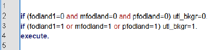

# Variabelkonstruktion med hjälp av syntax

Ett exempel på när bearbetningar är bra att göra i SPSS är när man vill kombinera olika variabler och
svaralternativ för att skapa en ny variabel.

En funktion för detta är Compute (se exemplet ovan), en annan är funktionen If. Med If kan man
precisera villkor för variabelvärden utifrån en eller flera variabler.

I skolunderökningen (Skol05.sav) finns tre variabler som anger födelseland: För eleven själv
(”fodland1”), för dennes mor (”mfodland”) respektive för dennes far (”pfodland”). Utifrån dessa tre
variabler kan man skapa en varaibel som anger utländsk bakgrund – ”utl_bkgr” - som får värdet 0 om
eleven själv och dennes föräldrar är födda i Sverige och värdet 1 om eleven själv och någon av dennes
föräldrar är födda i annat land.

Öppna syntax: File / New / Syntax

Skriv ett kommande som anger hur variabeln ska skapas (granska gärna kommandot nedan och fundera
över dess innebörd, täcker villkoren in alla? Finns andra möjliga definitioner?):

Markera programsatsen och klicka på den gröna pilen. I datafilen finns nu den nya variabeln ”utl_bkgr”. Nästa steg är att kontrollera så att den konstruerade
variabeln blivit korrekt: Ta fram en frekvens (se vidare nedan), ser fördelninge rimlig ut om du jämför
med ursprungsvariablerna? Kontrollera också gärna ett par av dina observationsenheter – utifrån de
värden de har på de tre ursprungliga variablerna, har det blivit korrekt? Därefter går du vidare med att
sätta labels på variabeln.

Obs: När du konstruerar nya variabler är det självfallet viktigt att dessa är genomtänkta och
välmotiverade.
