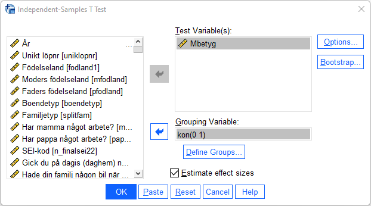

# T-test

När du vill pröva om en skillnad mellan två grupper är signifikant och utfallsvariabeln är kontinuerlig är
ett oberoende t-test tillämpligt. Här är proceduren att jämföra medelvärden mellan två grupper och
utifrån den uppmätta skillnaden ta reda på om den är tillräckligt stor för att antas gälla i populationen.
Anta att du är intresserad av om det finns någon skillnad i pojkars och flickors medelbetyg. Du vill
jämföra ett sammanfattande mått på deras betyg i kärnämnena svenska, engelska och matematik.
Betygsvariablerna är på ordinalskala och antar värden 0-3, se frekvenstabell nedan för betyg i
svenska:

Du skapar ett betygsindex (”Mbetyg”) som varierar mellan 0-3 genom att summera de tre betygen
och dividera med tre med hjälp av funktionen compute (se ovan under databearbetning).För att göra ett oberoende t-test, där du prövar om det finns en signifikant skillnad mellan pojkars och
flickors genomsnittliga betyg, är tillvägagångssättet följande: 

Analyze > Compare Means > Independent Samples T-test

Oberoende variabel är i detta fall ”kon” medan den beroende variabeln är ”Mbetyg”. Flytta den
beroende variabeln till rutan ”Test Variable(s)” och den oberoende variabeln till rutan ”Grouping
Variable”. Därefter måste du definiera vilka grupper inom denna variabel som du är intresserad av.
Genom att i variabelfönstret undersöka variabeln ”kon” ser du att variabelvärde 0 står för ”flickor”
och variabelvärde 1 står för ”pojkar”. Klicka på ”Define Groups” och ange dessa variabelvärden i
rutorna ”Group 1:” respektive ”Group 2:”. Klicka därefter ”Continue”.

Klicka ”OK” och gå till Output-fönstret. Du får nu fram resultaten i två tabeller. I den första tabellen
redovisas deskriptiva mått som antalet i respektive grupp samt respektive grupps medelvärde och
standardavvikelse på den beroende variabeln.

Vi ser att medelvärdet på betygsindex är 1,59 för flickor och 1,39 för pojkar. Flickor har alltså högre
betyg. Men är denna skillnad signifikant, d.v.s. kan anta att den även existerar mellan pojkar och
flickor i populationen? För att avgöra det tittar vi på nästa tabell:

I tabellen ovan redovisas ett antal relevanta mått för det oberoende t-testet. ”Mean Differance” är
skillnaden mellan de båda medelvärdena. I detta fall är skillnaden i genomsnittligt betyg 0,196.
Frågan är emellertid om skillnaden är tillräckligt stor för att fastställa att medelvärden skiljer sig åt i
populationen? P-värdet vid ett tvåsidigt hypotestest går att finna under rubriken ”Sig. (2-tailed)”. Ett
värde under 0,05 är signifikant på fem procents nivån. Här har vi ett värde på 0,00 vilket understiger
denna gräns. Vi kan således förkasta nollhypotesen som uttryckte att det genomsnittliga betyget är
samma för pojkar och flickor. (se vidare Djurfeldt m.fl. 2010/2018, s 230ff).

När vi gått igenom t-test på lektionerna har ett antagande gjorts om att de båda grupperna har samma
varians. Det finns emellertid två olika test - med eller utan antagande om lika varians (equal variance
assumed / equal variance not assumed). Skall man gå korrekt tillväga kontrollerar man att antagandet
håller. Det görs med Levene´s test for Equalite of Variances. F är kvoten av de båda gruppernas varians
och om denna kvot inte är lika med 1 kan det signalera att antagandet om lika varians inte håller. Om
sannolikheten för detta F-värde är mindre än 0,05 drar vi slutsatsen att skillnaden mellan urvalens
varians reflekterar en skillnad i populationernas varians. Om så är fallet, vilket det emellertid inte är här (P = 0,10) går vi till ”Equal variance not assumed”. ”Equal variance assumed” är mer restriktivt vilket
betyder att det är svårare att få ett signifikant resultat. Därför kan ni lika gärna använda detta test.

**Överkurs:** Enklaste sättet att förstå hur det ser ut när variansen är den samma för två grupper alternativt olika för två grupper är att illustrera gruppernas varians. I figurerna här nedan har vi grupp röd och grupp blå. Grupp röd har i genomsnitt 100 i värde i både den övre och nedre figuren. Grupp blå har i genomsnitt 130 i både den övre och nedre figuren. I den övre figuren har röd en standardavvikelse på 15 och blå har en standardavvikelse på 30. I nedre figuren har både röd och blå 15 i standardavvikelse.

Som vi kan se i den övre figuren är alltså spridningen (och därför variansen) större för grupp blå än för grupp röd. I nedre figuren är spridningen den samma (och därför variansen) för båda grupperna.

Om vi ska utföra ett t-test med den data som används för  den <b>övre</b> figuren komer SPSS att ange: ”Equal variance not assumed”.

Om vi ska utföra ett t-test med den data som används för den <b>nedre</b> figure kommer SPSS att ange: ”Equal variance assumed”.

