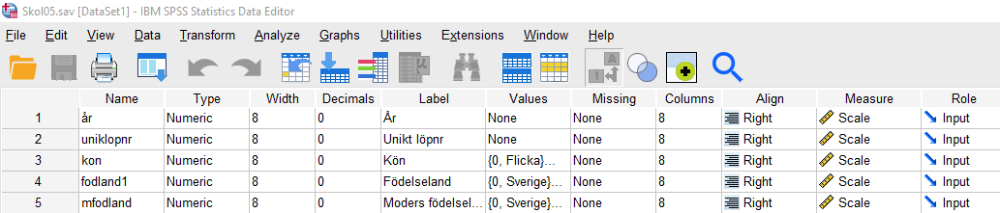
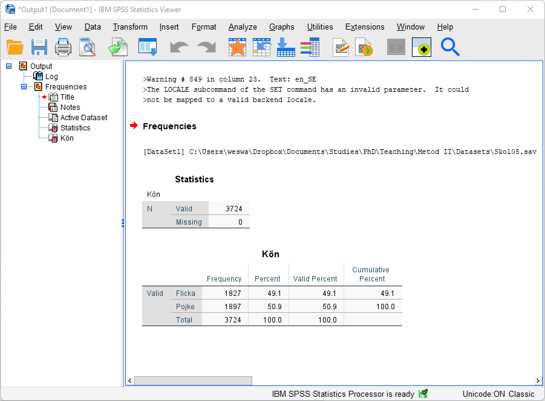
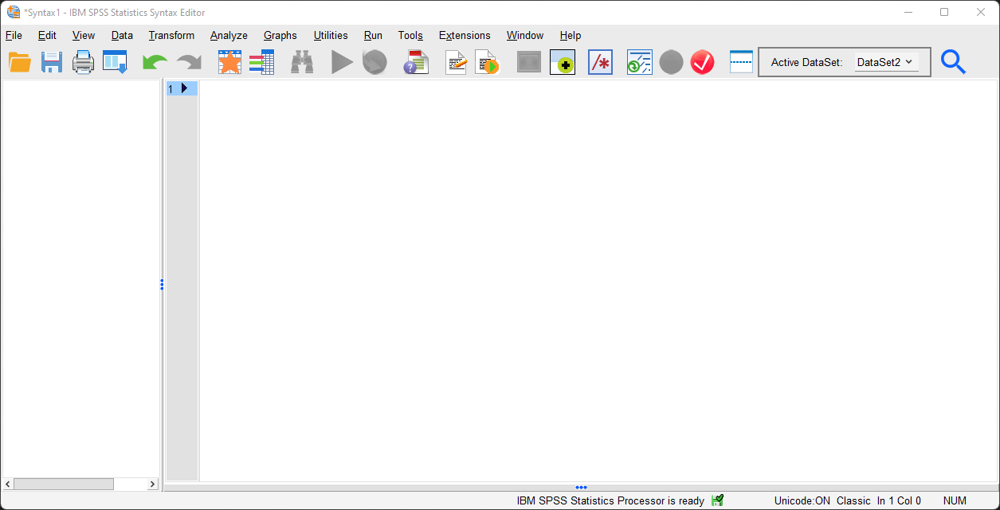

# Viktiga fönser i SPSS

SPSS innehåller flera olika fönster med skilda
funktioner.

## Datamatrisfönstret (Data view)

Detta fönster redovisar variablerna (t.ex. en
fråga i en enkäteundersökning) kolumnvis
och observationsenheterna (exempelvis de
skolelever som svarat på en enkät) radvis. En
enskild cell redovisar alltså en specifik
observationsenhets värde på en specifik
variabel.

## Variabelfönstret (Variable view)

I detta fönster visas de olika variablerna och
deras egenskaper. Variablerna redovisas
radvis och egenskaperna kolumnvis.
Byte av fönster görs enkelt genom att klicka
nere i vänstra hörnet, där man kan välja
mellan Data View och Variable View.

### Mer om variabelfönstret (Variable view)

När du öppnar ett befintligt datamaterial får du upp detta i datamatrisfönstret (Data View), antingen
med variabelvärden i text (bilden till vänster) eller som siffror (till höger). Hur man väljer att se värdena kan man ange via menyns ”View”):

  

I exemplet har datafilen Skol05.sav öppnats och varje rad motsvarar här en skolelev och dennes svar på
de olika frågorna i enkäten. Vid kodningen har varje svar kodats in med en siffra och dessa värden har
getts etiketter/labels.

Om du byter till Variable View (detta görs enkelt längst ner till vänster) ser du hur materialet kodats in
med etiketter (labels) som anger både en precisering av de olika variablerna och de olika variabelvärdena:

I variabelfönstret redovisas alltså variablerna radvis och dess egenskaper kolumnvis. I detta fönster
finns ett antal kolumner som är viktiga att känna till. Under den första kolumnen ”Name” listas
variabelnamnet på varje variabel i ditt dataset. Variabelnamnet hålls vanligtvis kort och det blir därför
ofta svårt att utläsa vad variabeln mäter. Information om vad variablerna mäter och hur de är
konstruerade finns ibland i en separat kodbok eller variabellista men du kan även förtydliga dina
variabler i själva datafilen. Under kolumnen ”Label” anges variabeletiketten, som är en kort beskrivning
av variabeln. Under kolumnen ”Values” anges vad variabelns olika värden svarar mot.

Variabeln ”kon” har till exempel värde 0 eller 1, där värde 0 betyder ”flicka” och värde 1 betyder
”pojke”. För att undersöka detta markerar du cellen för den aktuella variabeln under kolumnen
”Values” och klickar därefter på den lilla rutan till höger. Nu kommer fönstret ”Value Labels” upp.
Om variabeln saknar etiketterade variabelvärden kan du ange dessa genom att föra in värdet i rutan
”Value” och vad värdet står för i rutan ”Label”. Klicka därefter ”Add”. När du etiketterat samtliga
variabelvärden klickar du ”OK”.

Tänk på att variabelns värden endast behöver specificeras för variabler som befinner sig på nominaleller
ordinal skalnivå. Om du till exempel har en kontinuerlig variabel som mäter ålder i antal år
(kvotskala) är variabelvärdena i sig informativa och du behöver inte förtydliga vad dessa står för.

## Output-fönstret (Output)

I detta fönster visas resultat. Det kan röra sig
om frekvenstabeller, korstabeller eller olika
typer av diagram. Till vänster finns en
översiktsmeny där du enkelt kan bläddra
mellan dina resultat.

## Syntax (Syntax editor)

Vissa bearbetningar av data där man vill kombinera olika variabler kan vara enklare att göra i syntax. I syntax kan du skriva kommandon, dvs. det du vill att SPSS ska göra åt dig – en frekvenstabell,
korstabell, omkodning av variabler mm. Alla sådana moment har sina egna kommandon.

Du kan öppna syntax via File > New > Syntax:

Kommandon kan antingen skrivas direkt i syntax eller så kan du gå via menysystemets funktioner och
klick på Paste

Klickar du på denna knapp så kommer syntax kommandot för denna omkodning att öppnas i
syntaxfönstret:

“Syntaxspråket” tar ett tag att lära sig, och är heller inte nödvändigt för er att kunna, men att använda
sig av syntax (direkt eller via ”paste”) kan många gånger underlätta arbetet i SPSS och om du sparar
syntax får du en loggbok över det du har gjort, på så sättt är det enkelt att gå tillbaka för att se hur du
gått tillväga vid analyser, omkodningar etc. (Om du sparar de kommandon och körningar du har gjort
och har användning för i syntax, skriv gärna rubriker/kommentarer som anger vad och varför du gjort
olika moment. Obs: För att inte programmet ska missta rubriker/kommentarer för kommandon måste
du skriva en asterisk (*) före dessa och avsluta med en punkt.). Om ni är intresserade av att <a href="https://www.spss-tutorials.com/spss-syntax/">lära er mer om syntaxspråket rekommenderas följande sida.</a>